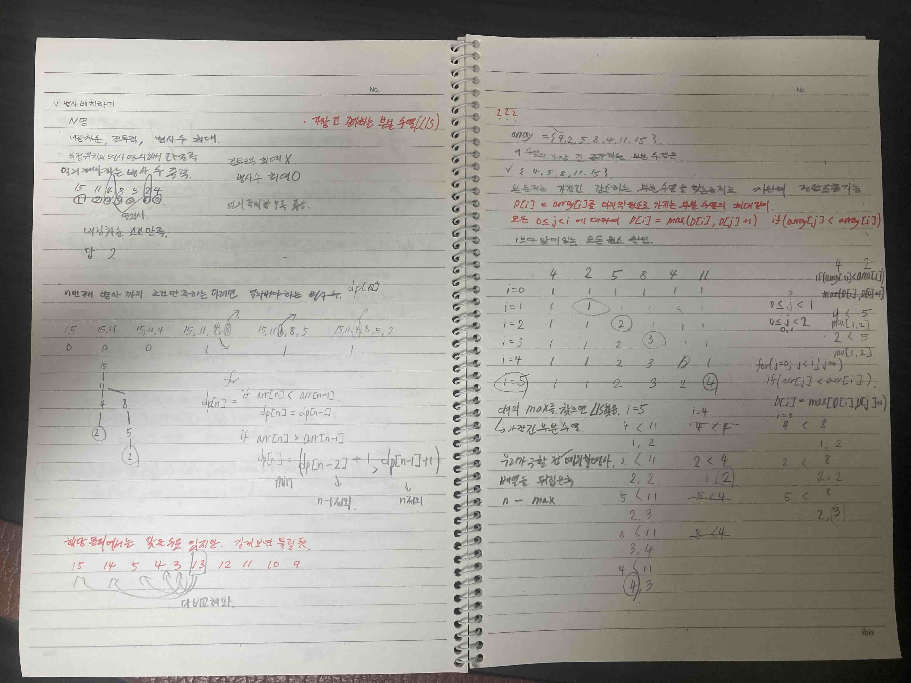

# 2022.03.27.

처음에 풀고 예시 데이터 넣어보고 맞아서 푼 줄 알고 기분 좋았다.

강의 보다보니까 고려하지 못한 부분이 있다는 것을 알게 되었다.

이 문제는 가장 긴 증가하는 부분 수열(LIS) 라는 DP 문제 유형을 응용한 문제라고 한다.

쉽지 않네...

로직도 처음엔 이해가 안됐지만 내가 컴퓨터다 생각하고 하나씩 for, if 에 값 넣어서 돌려보니까 이해 됐다.

일단 DP 문제 풀이는 끝이 났다.

책이 너무 좋아서

책 처음부터 풀지 아니면 백준을 순서대로 풀지는 고민해봐야겠다.