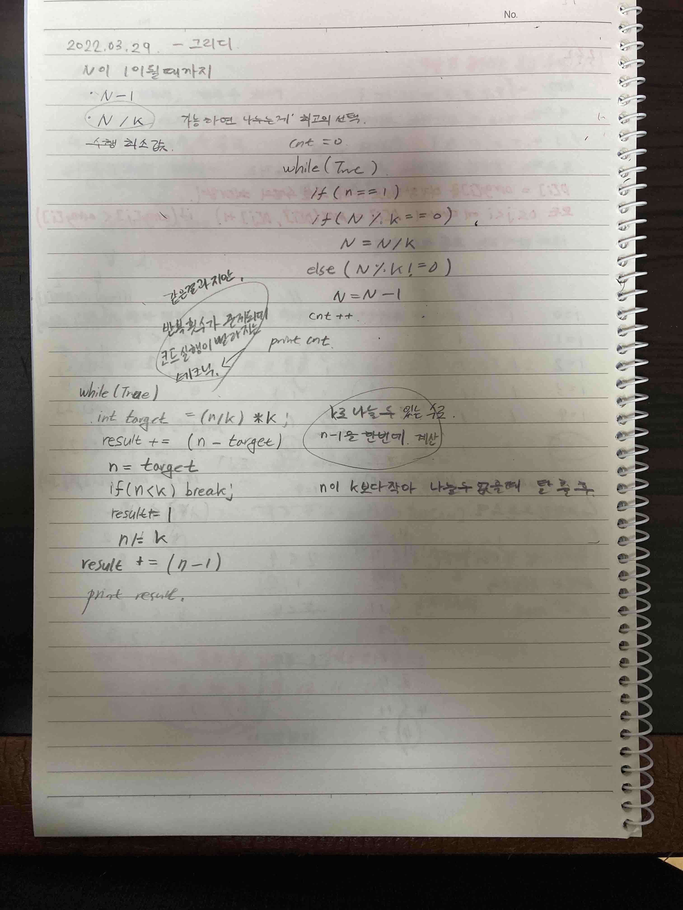

# 2022.03.29 - 그리디

현재 상황에서 지금 당장 좋은 것만 고르는 방법

문제를 풀기 위한 최소한의 아이디어를 떠올릴 수 있는 능력 요구

정당성 분석 중요 ( 단순히 가장 좋아보이는 것을 반복적으로 선택해도 최적의 해를 구할 수 있는지 검토 )

=> 일반적인 상황에서 최적의 해를 보장할 수 없을 때가 많다.

하지만 코테에서의 그리디 문제는

탐욕법으로 얻은 해가 최적의 해가 되는 상황에서 이를 추론할 수 있어야 풀리도록 출제

### 거스름돈 문제

최적의 해 : 가장 큰 화폐 단위 부터 거슬러 주면 됨

이게 정당한 이유는?

-> 가지고 있는의 큰 단위가 항상 작은 단위의 배수이므로

작은 단위의 동전들을 종합해 다른 해가 나올 수 없기 때문

문제 풀이를 위한 최소한의 아이디어를 떠올리고 

이것이 정당한지 검토 할 수 있어야함

시간 복잡도 O(K) : 금액이 아니라 동전의 총 종류에만 영향을 받음

### 1이 될 때 까지
* N 에서 1 뺀다
* N 을 K 로 나눈다
1이 될 때까지 이 과정을 반복, 이 과정을 수행해야 하는 최소 횟수

최대한 많이 나누기가 정당한 이유는?
* 항상 k 로 나누는 것이 1을 빼는 것 보다 빠름
* 항상 N은 1에 도달할 수 있음

**다이나믹 프로그래밍의 1 이 될때 까지와 다른 점**

다이나믹 프로그래밍은 나누는 값이 여러개로

큰수로 나누는 것이 항상 최적의 해라고 보장할 수 없기에 

최적의 값을 찾기 위해 dp 테이블을 이용한다.

Make1Greedy 로 간단하게 풀이가 가능하지만

약간의 테크닉을 이용해 Make1GreedySol 처럼 작성하면 반복 횟 수가 줄어 빠르게 문제 해결 가능

n % k == 0 이 아닐 경우 
n - 1 하는 것이 아니라 

n % k == 0 이 되는 값을 구해 한 번에 계산