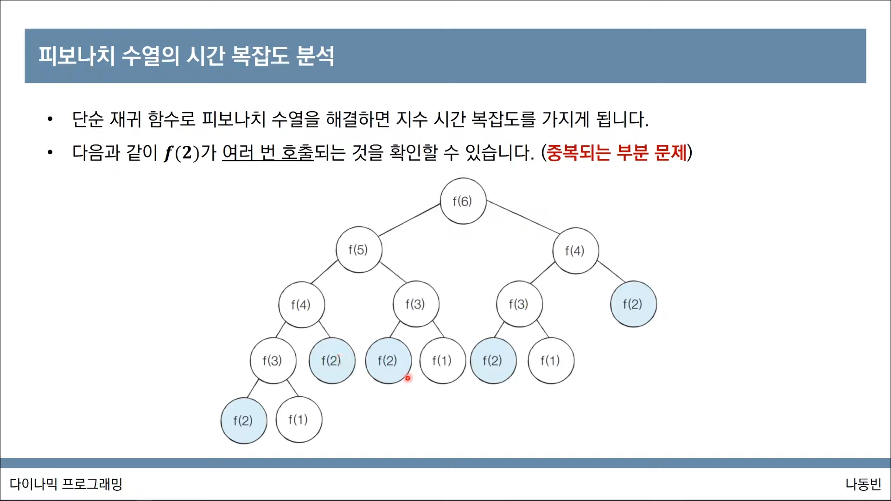
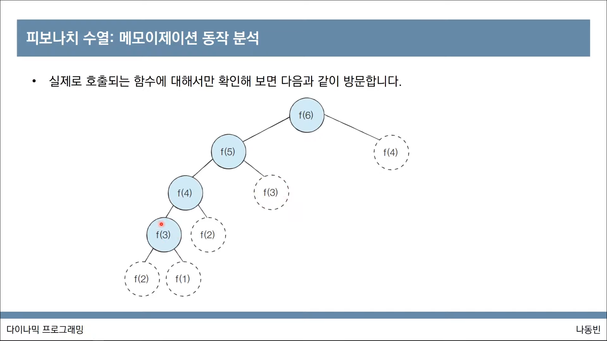

# 다이나믹 프로그래밍 ( 동적 계획법 )

메모리를 적절히 사용해 수행 시간 효율성을 비약적으로 향상 시키는 방법

이미 계산 된 결과를 별도의 메모리 영역에 저장해 다시 계산 X

탑다운과 보텀업으로 구성

### 사용 조건
```
* 최적 부분 구조
    큰 문제를 작은 문제로 나눌 수 있으며 작은 문제의 답을 모아 큰 문제를 해결할 수 있음

* 중복 되는 부분 문제
    동일한 작은 문제를 반복적으로 해결해야 함
```

## 피보나치 수열
`a(n) = a(n-1) + a(n-2), a(1) = 1, a(2) = 1`

다이나믹 프로그래밍 예시

재귀함수 만으로도 피보나치 수열을 구현할 수 있으나 지수 시간 복잡도를 가진다



위의 그림처럼 같은 값이 여러번 호출 되는 경우 발생

## 메모이제이션(Memoization)

이 문제를 해결하기 위해 메모이제이션(Memoization) 

한 번 계산한 결과를 메모리 공간에 메모하는 기법 ( 캐싱 )

그리고 같은 문제를 다시 호출하면 메모했던 결과를 그대로 가져옴

메모이제이션 != 다이나믹 프로그래밍

이전에 계산된 결과를 일시적으로 기록해 놓는 넓은 개념을 의미

저장을 하고 활용하지 않을 수도 있음 캐시, 메모이제이션을 사용했다고 표현

다이나믹 프로그래밍을 구현하는 방법 중 하향식 방법으로 접근할 때

이미 계산된 결과를 기록하는 방법으로 메모이제이션을 사용할 수 있는 것.


## 탑다운 보텀업
탑다운 - 하향식 <- 메모이제이션

보텀업 - 상향식 <- 다이나믹 프로그래밍의 전형적인 형태

우선 작은 문제를 해결하고 이를 활용해 큰 문제를 해결

결과 저장용 리스트, 배열을 DP 테이블이라 부름


## 피보나치 수열 : 메모이제이션 동작 분석

메모이제이션 기법을 이용할 경우 피보나치 수열의 함수 복잡도 O(N) (선형 시간 복잡도)

f(6) -> f(5) -> f(4) -> f(3) -> f(2) -> f(1) -> f(2) -> f(3) -> f(4)

## 다이나믹 프로그래밍 VS 분할 정복


# 공부 자료
https://www.youtube.com/watch?v=5Lu34WIx2Us

위의 영상을 기반으로 공부 했으며 문제가 될 경우 바로 삭제 하겠습니다.

# 느낀점

강의 보면서 감탄을 했다.

글로 읽어서는 이해가 안됐는데 설명을 들으면서 읽으니까 이해가 잘 됐다.

문제도 풀어봤는데 어려웠다.

처음부터 잘하려 하지 말고 꾸준히 해야겠다.