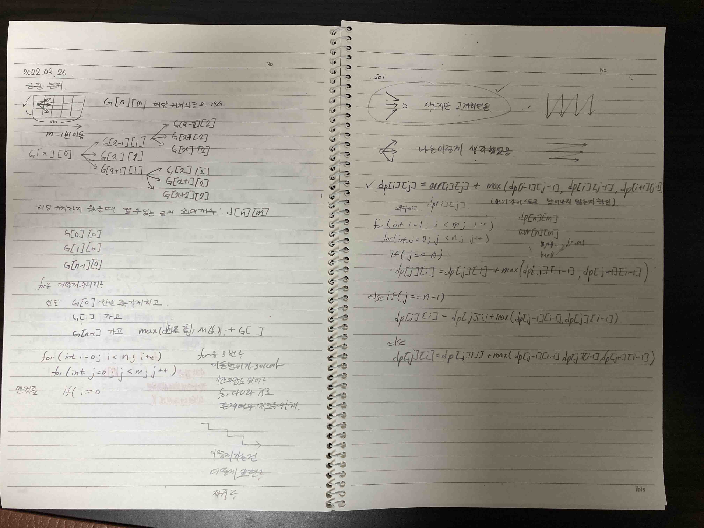

# 2022.03.26.

다이나믹 프로그래밍에 전보다 익숙해져서 

작은 문제로 쪼개고 이게 어떻게 반복되는지를 먼저 보게 되었다.

그래도 아직 부족하다고 느낀 것이 

나는 어떻게 나아갈지를 생각 했지만

문제를 해결하기 위해서는 이 답을 찾기 위해선 어떤 값들이 필요한지에 초점을 맞췄어야 했다.

2차원 배열을 오랜만에 다뤄 차원이 헷갈렸다.

뇌정지가 자주 왔지만 그려가면서 해결 했다.

그리고 이 문제 input 받는 것도 쉽지 않았다.

갈길이 멀다는 것을 다시금 느꼈고 꾸준히 풀어 나가야 할 듯 하다.