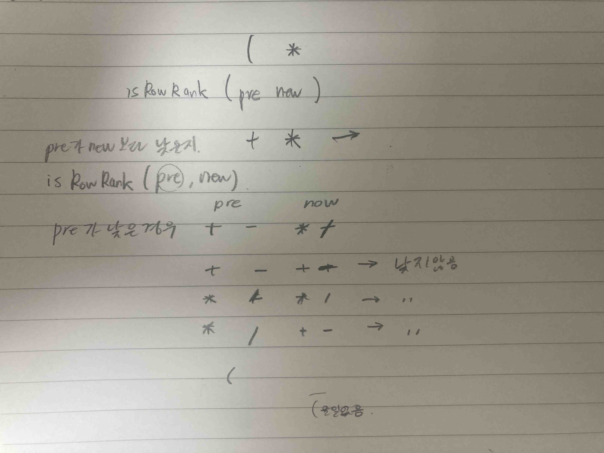

# 2022.04.01.

## 정리
* 함수의 정의를 확실하게 할 것.
* 조건을 확실하게 구분 할 것
* 우선 글으로 로직을 구현해 볼 것.
* 해야할 것을 명확하게 정의 할 것.
  * 말로 해보거나 적어서. 생각으로만 하면 좀 가다가 꼬였음
  * 이 함수 역할은 preIn 이 newIn 보다 작은지 정의하는 함수다.
  * preIn 이 newIn 보다 작은 경우는 ~ 가 있다.
  * 내가 지금 필요한 것이 ~ 니까 ~를 하자.



## Q1918 후위 표기식

https://www.acmicpc.net/problem/1918

차량 기지 알고리즘

연산자만 스택에 넣고 숫자는 바로 출력(or 큐에 저장)

```
while exp 가 비어있지 않으면
    '('
        push
    ')'
        while '(' 나올 때 까지
            result += pop() 
    '숫자'
        result += ch
    '연산기호'
        우선순위 낮으면
            push
        우선순위가 같거나 높으면
            result += ch
            push
```
이렇게 로직을 정리 했다.

근데 이걸 코드로 깔끔하게 옮기는게 생각만큼 쉽지 않았다.

보면 간단한데 막상 옮기려하면 생각이 멈추는지 모르겠다.

문제가 나한테 있는거라 나한테 짜증이 났지만

이 문제를 해결 할 수 있는 것도 나 밖에 없다.

꾸준히 해라 악깡버.....

문자열 문자 어떻게 처리해야할지 확실하지 못한 것도 큰 듯

자바 하자.

잠시 시간을 갖고

말로 하듯이 풀어서 하나 하나 다시 해봤다.
```
static boolean isRowRank(char preIn, char newIn) {
        if ('(' == preIn) {
            return true;
        }
        if ('*' == newIn || '/' == newIn) {
            if ('+' == preIn || '-' == preIn) {
                return true;
            }
        }
        return false;
    }
    
while (!s.empty() && !isRowRank(s.peek(), ch)) 
```
여기 부분의 반환 값이 잘 못되어 난 오류 였다.

일단 함수의 정의가 애매했다.

perIn 이 newIn 보다 작은가? 라는 정의 없이 

작은가? 라는 의미로 생각해 중간 중간 사용법이 꼬였던 것 같다.

찾아본 코드의 경우 boolean 을 반환한 것이 아니라 int 로 우선 순위를 반환했다.

그리고 사용할 때 반환된 우선 순위를 가지고 비교해서 사용 했다.

나는 함수의 호출을 줄이려고 한 번에 비교해서 boolean 으로 반환 했지만

찾아본 코드 처럼 사용하는 것이 함수의 호출은 더 많을지라도 더 명확한 코드라고 느껴졌다.

```
static int precedence(char ch) {
    if(ch=='(') return 0;
    if(ch=='+' || ch=='-') return 1;
    else return 2;
}

while (!ops.isEmpty() && precedence(ops.peek()) >= precedence(ch)) {
```

### 기타 JAVA 문법

string : .equals

char : ==

string.toCharArray() : python의 string[i] 처럼...

```
char t = 'B';
System.out.println("'B' = " + (int)'B'); // 66
System.out.println("'Z' = " + (int)'Z'); // 90
System.out.println("t <= 'A' && t <= 'Z' = " + (t <= 'A' && t <= 'Z')); // A ~ Z 를 제외한 값
System.out.println("t >= 'A' && t >= 'Z' = " + (t >= 'A' && t >= 'Z'));
System.out.println("t <= 'A' && t >= 'Z' = " + (t <= 'A' && t >= 'Z'));
System.out.println("t >= 'A' && t <= 'Z' = " + (t >= 'A' && t <= 'Z')); // A ~ Z 사이의 값
```

조건문의 순서
```
while (!isRowRank(s.peek(), ch) && !s.empty()) { // 이렇게 하면 s가 비어있을 경우 오류 발생

while (!s.empty() && !isRowRank(s.peek(), ch)) { // s.empty 로 s.peek 해 올 것이 있는지
```
