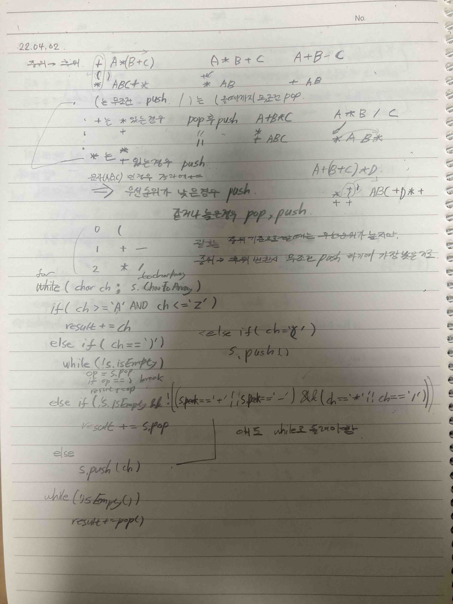

# 2022.04.02.
## 할 것
* 어제 한 것 복습
* 스택과 큐 / https://www.youtube.com/watch?v=ktvhRSRohR4
* 스택과 큐 활용 / https://www.youtube.com/watch?v=pTFXPY8tBC4

### Q1918
for (char ch : s.toCharArray()) {

if ('A' <= ch && 'Z' >= ch) {

static int precedence(char ch) {

코드 진짜 깔끔하게 잘 짰네. 기억해 두기.

처음 한다 생각하고 다시 짜봤다.

while 문 하나 고려 못 했고

메서드 대신 그냥  while 문 조건으로 줬다.

확실히 메서드로 빼는게 가독성이 좋은 듯하나

처음부터 메서드로 짜기엔 무리가 있었다.

일단 짜고 필요시 코드 리팩토링을 해야겠다.

    while(!s.isEmpty() && !(((s.peek() == '+' || s.peek() == '-') && (ch == '*' || ch == '/')) || (s.peek() == '('))){

    
### 자바의 정석 Stack 과 Queue

    for (int i = 0; i < list.size(); i++) {
보다 

    final int SIZE = list.size();
    for (int i = 0; i < SIZE; i++) {
가 좋다.

반복문 돌아도 list.size 의 크기는 동일한데
돌때마다 계속 호출 되니까.
