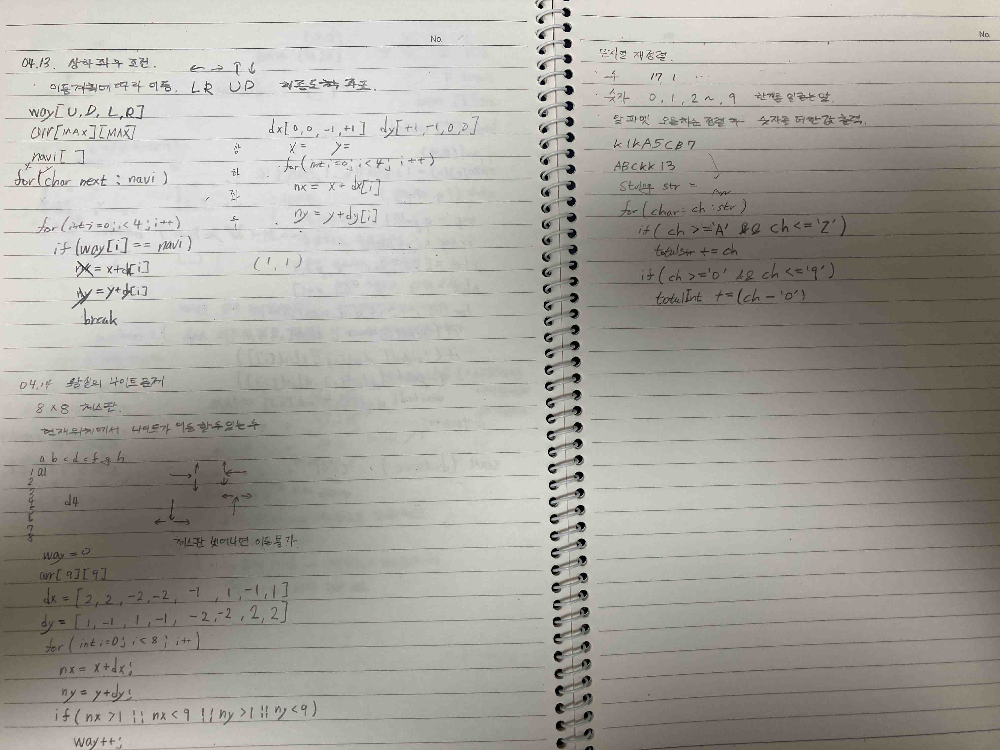

# 2022.04.14.

## 왕실의 나이트 문제

어제 배운 방향 벡터 이용해 구현

## 문자열 재정렬
Collections.sort(result);

정렬 관련 참고 자료

https://wjheo.tistory.com/entry/Java-%EC%A0%95%EB%A0%AC%EB%B0%A9%EB%B2%95-Collectionssort

내일은 [정렬](https://www.youtube.com/watch?v=KGyK-pNvWos&list=PLRx0vPvlEmdAghTr5mXQxGpHjWqSz0dgC&index=4)