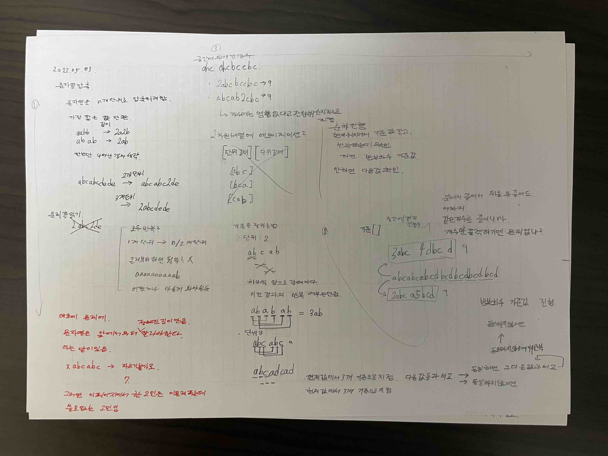
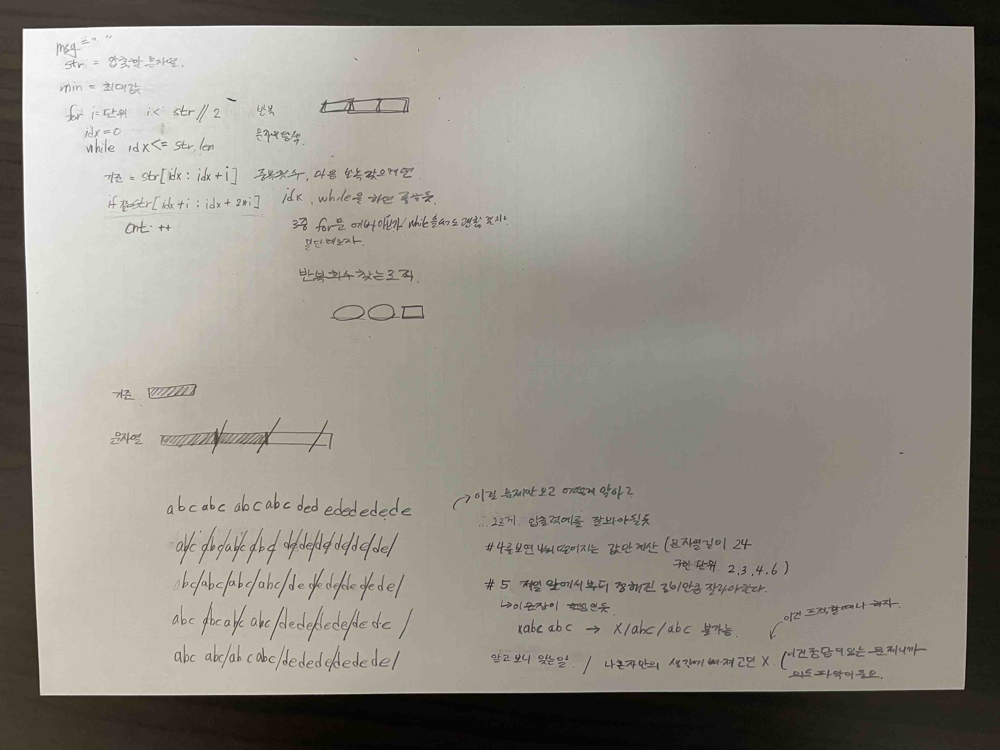

# 2022.05.03.

어쩌다보니 이코테 개념 다 훑어 봄

아직 구현은 완벽하지 않지만

어떤 아이디어인지는 알고 있으니까

풀다가 막히면 그때 그때 다시 복습 하려함.

[프로그래머스](https://programmers.co.kr/learn/challenges)

# 코딩테스트 연습 / 2020 KAKAO BLIND RECRUITMENT

[문자열 압축](https://programmers.co.kr/learn/courses/30/lessons/60057)

```
문제 잘 읽기.
문제를 제대로 이해 했는지가 먼저.
문제에 대한 해석을 잘 못하면 코드가 돌아가도 이 문제에서 원하는 답은 아님.
내 마음대로 해석하지 말고, 문제에 나온대로 해석 하기.
```

문자열을 1개 이상의 단위로 잘라서 압축하여 더 짧은 문자열로 표현할 수 있는지 방법

* 입출력 예 #4 abcabcabcabcdededededede

* 문자열을 딱 나눠지는 것으로만 자름.

5, 7, 11... 이렇게 안 나눠 지는 것으로는 예시를 들지 않았음

* 입출력 예 #5

x/abc/abc -> 불가

## 처음 아이디어

for 문으로 1 ~ 문자열길이/2 만큼 다 반복해 보려 했음

시간 복잡도가 괜찮나 싶었지만 딱히 제한 없어서 일단 진행

abcabcabcdbcdbcdbcdbcd 인 경우 어떻게 잘라야할지 고민

3abcd4bcd or 2abcab5bcd

결국 길이는 같으니 개수만 출력에는 문제 없다고 판단

이 아이디어로 구현 하다보니

for 문이 3중첩까지 되어 아닌가 싶었음

반복 회수를 찾는 로직도 생각 못 했음

1시간 지나서 풀이 아이디어 확인

## 풀이 아이디어

문제를 잘 못 파악함.

abc/abc/abc/dbc/dbc/dbc/dbc/d

ab/ca/bc/ab/cd/bc/db/cd/bc/db/cd

나눠지는 값만 처리 가능한지는 정확하게 문제에 나와있지는 않지만

이런 식으로 앞에서부터 단위 만큼 잘라서

중복되면 압축해 표시하는 문제.





