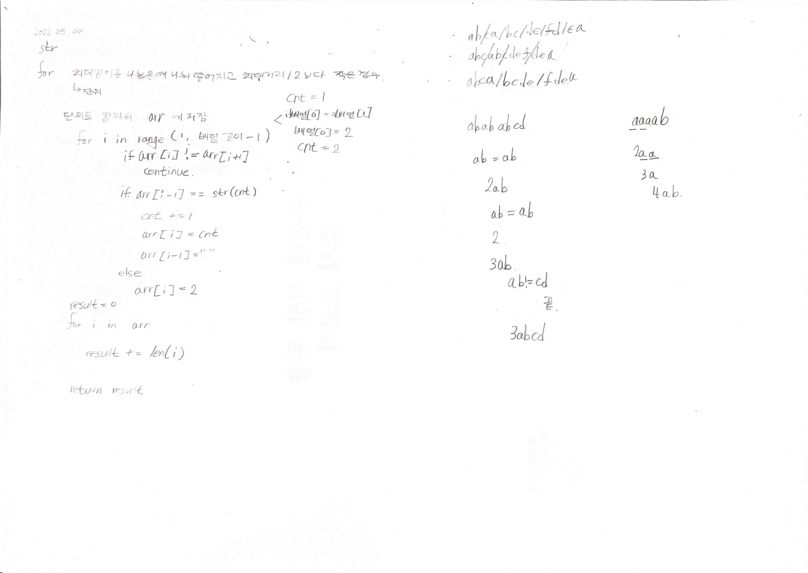

# 2022.05.04.

# 저작권

기업 코테는 올리면 안 되지만 2020 KAKAO BLIND RECRUITMENT, Summer/Winter Coding 는 이미 연습문제로 공개해서 비상업적, 비영리적 용도로 게시할 수 있습니다.

코딩테스트 연습 문제의 지문, 테스트케이스, 풀이 등과 같은 정보는 비상업적, 비영리적 용도로 게시할 수 있습니다.

best 코드는..... 원작자 이름이랑 같이 해서 올려야겠다.

공개 된거니까 괜찮을 것 같기는 한데

그래도 혹시 원치 않으시거나 문제 되는 부분 있다면 issue 에 남겨주세요!

[관련 글](https://programmers.zendesk.com/hc/ko/articles/360034546572-프로그래머스의-알고리즘-문제-풀이를-개인-블로그-GitHub-기타-사이트에-올려도-되나요-)

# 소감

저녁에 하지 말고 아침에 하자..

해결!

해당 문제에 테스트 케이스 추가해서 정답 맞추는 과정 기록
