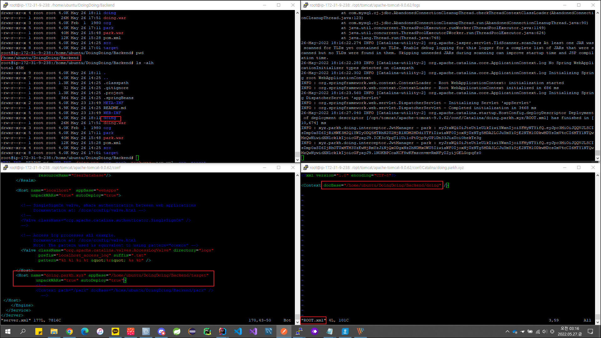

# 2022.05.26.

## 하고 싶은 것

doing.parkh.xyz:8080/api/~

mogakco.parkh.xyz:8080/api/~

서버 하나를 서브 도메인 이용해 이런식으로 나누려고 함.

## 해결 완료

* conf/server.xml

```
      ......
      
      <Host name="localhost"  appBase="webapps" unpackWARs="true" autoDeploy="true">
        <Valve className="org.apache.catalina.valves.AccessLogValve" directory="logs"
               prefix="localhost_access_log" suffix=".txt"
               pattern="%h %l %u %t &quot;%r&quot; %s %b" />
      </Host>
      
      <Host name="doing.parkh.xyz" appBase="/home/ubuntu/DoingDoing/Backend/target" 
            unpackWARs="true" autoDeploy="true">
     </Host>
    </Engine>
  </Service>
</Server>
```

* conf/Catalina/doing.parkh.xyz/ROOT.xml

```
<Context docBase="/home/ubuntu/DoingDoing/Backend/doing" />
```

doing.parkh.xyz:8080/api/~

* conf/Catalina/doing.parkh.xyz/doing.xml

```
<Context path="~~~~" docBase="/home/ubuntu/DoingDoing/Backend/doing" />
```

doing.parkh.xyz:8080/doing/api/~



## 과정

톰캣 설정 중인데 마음 처럼 안 된다.

* conf/server.xml

```
      ......
      
      <Host name="localhost"  appBase="webapps" unpackWARs="true" autoDeploy="true">
        <Valve className="org.apache.catalina.valves.AccessLogValve" directory="logs"
               prefix="localhost_access_log" suffix=".txt"
               pattern="%h %l %u %t &quot;%r&quot; %s %b" />
      </Host>
      
      <Host name="doing.parkh.xyz" appBase="/home/ubuntu/DoingDoing/Backend/target" 
            unpackWARs="true" autoDeploy="true">
              <Context path="/park" docBase="/home/ubuntu/DoingDoing/Backend/park" />
     </Host>
    </Engine>
  </Service>
</Server>
```

톰캣 전체 설정에 추가하면 되지만 공식문서에 권장하지 않는 방법이라 되어 있다. 이렇게 하면 원하는 대로 나눌 수 있으나 변경 할 때마다 Tomcat 재실행 해줘야함

그래서 각각 파일 관리 하는 방법으로 해보고 있는 중인데 잘 안 됨

하나씩 계속 바꿔가면서 왜 안되는지 분석

각 프로젝트 단위로 Context 에 등록하고 이를 Host 에 등록.

Engine > Host > Context

http://{Host}:{Port}/{Context}

* conf/Catalina/doing.parkh.xyz/doing.xml

```
<Context path="~~~~" docBase="/home/ubuntu/DoingDoing/Backend/doing" />
```

doing.xml 이면 path 를 뭐라고 줘도 상관 없이 xml 파일 이름으로 경로가 잡힘

docBase 폴더에 있는 내용 실행 됨

doing.parkh.xyz:8080/api~~ 로 사용하고 싶으면 ROOT.xml 에 내용 추가하면 됨

+ war 최종 이름 지정

pom.xml

```
...
<build>
<finalName>${project.artifactId}</finalName>
```

## Reference

https://tomcat.apache.org/tomcat-9.0-doc/config/context.html#Defining_a_context

https://stackoverflow.com/questions/14488509/maven-how-to-rename-the-war-file-for-the-project