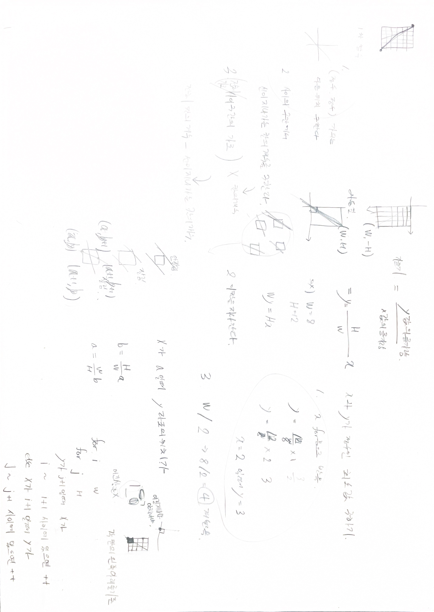

# 2022.05.31.

[멀쩡한 사각형](https://programmers.co.kr/learn/courses/30/lessons/62048)

그냥 되겠지 했던게 생각처럼 안됐다.

```
double slope = (double) h / (double) w;

// (ax, by) // x와 y가 정수인 (0, 0) 이후의 최소 값
int ax = w; 
int by = h; 

for (int i = 1; i < w; i++){
    if (slope * i - (int)(slope*i) == 0){
        ax = i;
        by = (int)slope * i;
        break;
    }
}
```
하면 되겠지... 했는데 안 됐다.

디버깅툴로 값 찍어 봐가면서 해야겠다.

