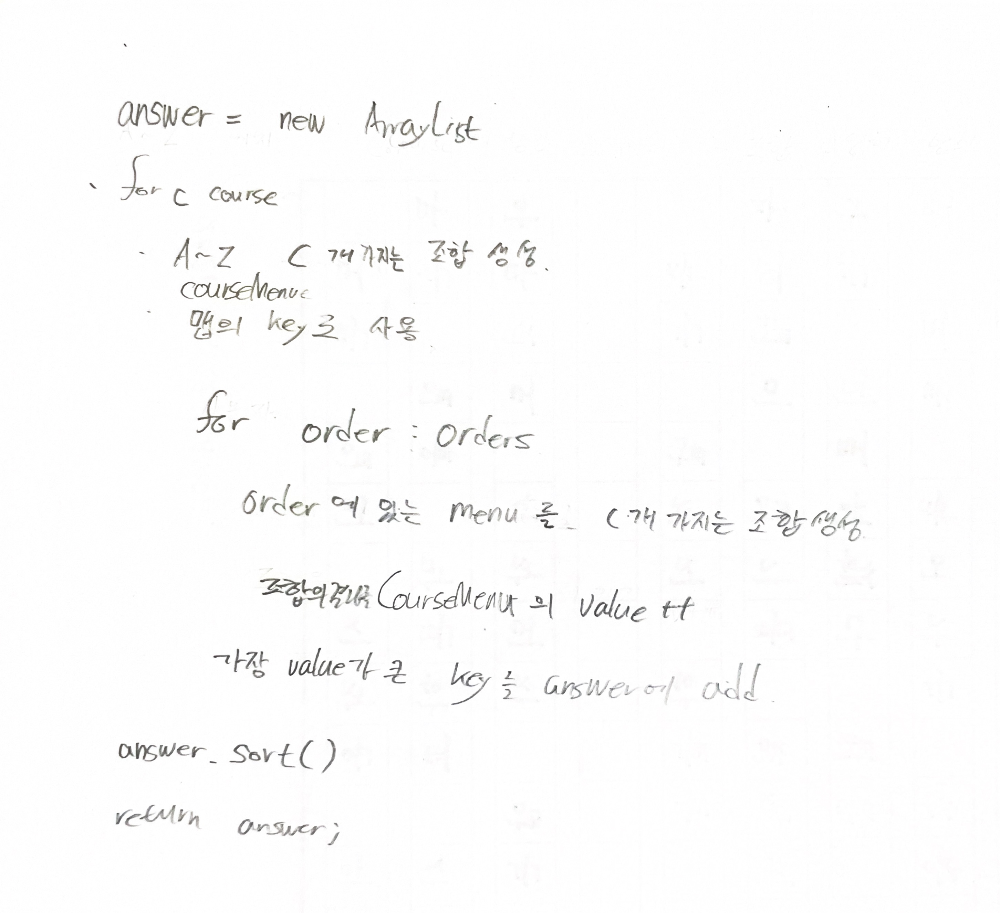

# 2022.08.15.

## 메뉴 리뉴얼

[메뉴 리뉴얼](https://school.programmers.co.kr/learn/courses/30/lessons/72411)

### 문제 정리

각 손님이 주문할 때 가장 많이 주문한 조합 -> 코스 요리로 구성

코스 요리는 두 가지 이상의 단품 메뉴, 두명 이상의 손님으로 부터 주문된 조합

주문 목록, 원하는 단품 메뉴 개수를 배열에 담아 입력

조합된 코스 요리를 오름차순으로 정렬해 배열

### 생각

이렇게 풀면 되지 않을까? 생각해봤다.

풀이법이 맞나 확인해보고 구현해봐야겠다.

풀이가 많고 봐도 모르겠는데

https://www.youtube.com/watch?v=Jb34jY91450

진국 강의 찾았다...!

여기 있는 문제를 가지고 풀어야 겠다.
