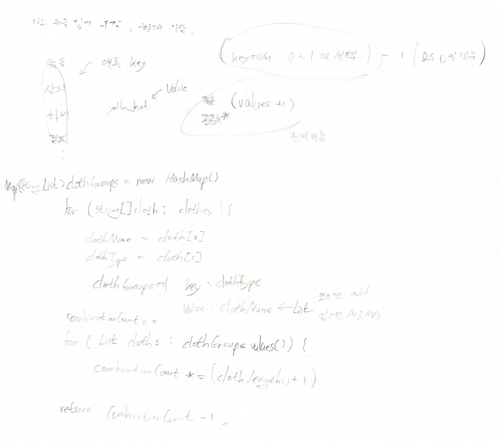

# 2022.08.16.

## 위장

[위장](https://school.programmers.co.kr/learn/courses/30/lessons/42578)

## 풀이

## 강의

종류별로 개수를 구해야 할 경우 Hash 를 이용하면 쉽다.

의상의 이름은 중요하지 않고 종류별 개수를 구해 곱하면 되기 때문에 Map<String, Integer>

getOrDefault(key, defaultValue) map에 key 가
null 이면 defaultValue
null 이 아니면 map.get(key)

Iterator 이용해 List 탐색

## 소감

쉽게 풀었는데 강의에 더 좋은 방법이 있어 좋았다.

무턱대로 어려운거 푸는 것 보다

이렇게 풀만한거 풀면서 더 나은 방법이 있는지 찾아보고 고민하는게 지금 상태에서는 더 좋은 것 같다.