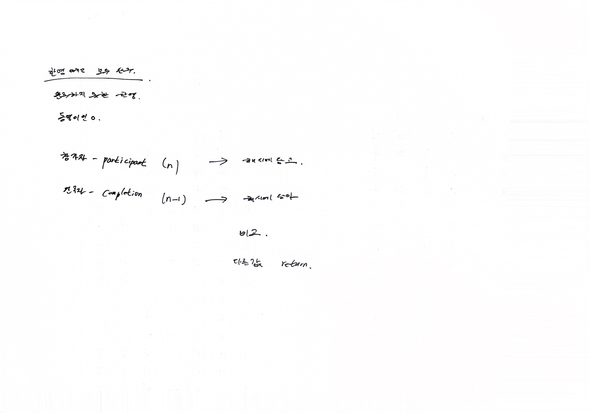

# 2022.08.17.

## 완주 하지 못한 선수

[완주 하지 못한 선수](https://school.programmers.co.kr/learn/courses/30/lessons/42576?language=java)

## 풀이

해시 쓰니까 가뿐하네

## 강의

[강의](https://www.youtube.com/watch?v=_2yD46UxSso)

1. 리스트
    1. 두 배열을 정렬.
    2. 두 배열의 값이 다를 때까지 탐색.
    3. 없다 -> 마지막에 오는 선수가 완주 못한 선수.

해시를 활용하는 것도 좋지만, 정렬만 잘하면 풀 수 있음.

어 되겠다? 각 보이면 일단 풀어보는 것도 나쁘지 않음

2. 해시

전화번호부 같은 key, value 의 자료 구조.

map.put(player, map.getOrDefault(participant, 0) + 1);

entrySet 이런 것도 있긴 하구나.. Iterator 편하긴 하네

여기선 keySet() 이 더 편하니까 keySet() 써야겠다.