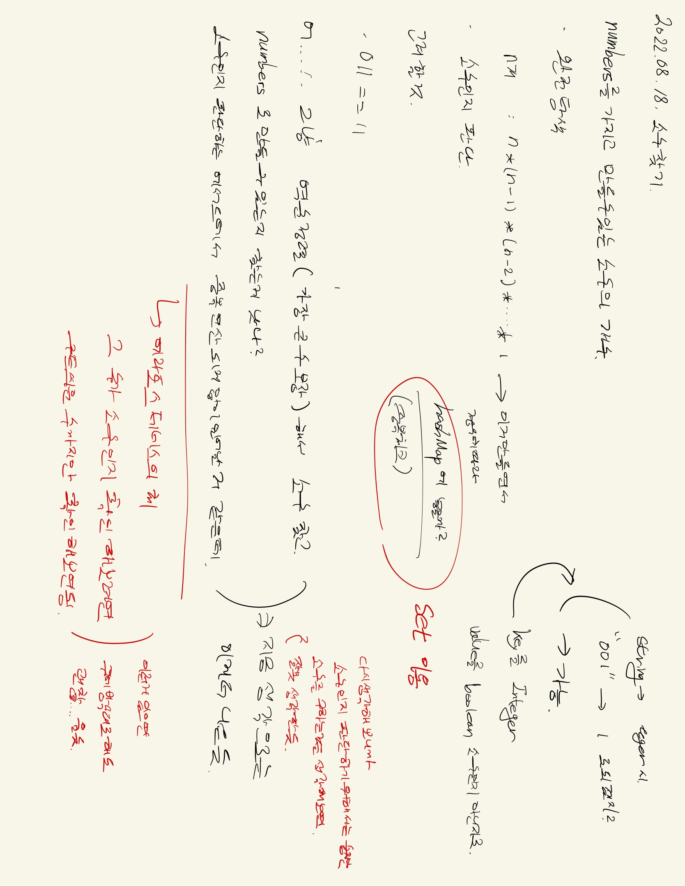

# 2022.08.18.

## 소수 찾기

[소수 찾기](https://school.programmers.co.kr/learn/courses/30/lessons/42839)

## 강의

문제를 어떻게 접근 해야하는지 알기 좋았음

[강의](https://www.youtube.com/watch?v=pF368QqdQb4)

### Iterator

자료 구조에 상관 없이 돌릴 수 있어서 한번 익혀두면 편하다...!

### 재귀

내가 지금 뭐해야하는지 논리만 정확하게 서있다면 재귀도 그렇게 어렵지 않음

나는 현재까지 만든 조합을 가지고 numberSet 을 추가할 거고

다음 조합에는 이걸 넘겨줄거야

### 에라스테네스의 체

그 수가 소수인지 확인해보려면 루트를 씌운 수까지만 배수 여부를 확인해 보면 됨

### 팁

일단 큰 그림을 그림 (tdd 처럼)

만들 수 있는 조합을 재귀를 이욯해 numberSet 에 저장할거야...

numberSet 의 값을 돌면서 isPrime 이라는 메서드로 소수인지 판단하고, 개수를 셀거야

이런식으로 큰 그림을 먼저 그리고 여기서 필요한건 이거. 여기서 필요한건 이거.

