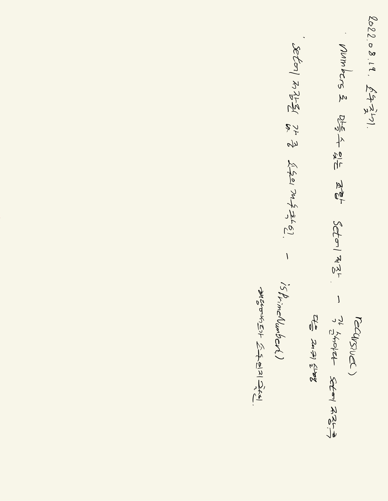

# 2022.08.19.

## 소수 찾기

[소수 찾기](https://school.programmers.co.kr/learn/courses/30/lessons/42839)

어제 본 [강의](https://www.youtube.com/watch?v=pF368QqdQb4) 기억해서 풀이



### 재귀 종료 조건

```
public void recursive(String combination,String others){
        // 1. 종료 조건
        if(others.length()==0){
            return;
        }

        // 2. 동작
        if(combination.length()!=0){
            set.add(Integer.parseInt(combination));
        }

        // 3. 재귀 호출
        // 3.1 others 에서 남은 값 모두 확인
        for(int i=0;i<others.length();i++){
            recursive(combination+others.charAt(i),others.substring(0,i)+others.substring(i+1));
        }
}
```

종료 조건이 있어야지 하고 이렇게 넣었다. 근데 이렇게 하면

numbers 전체를 가지고 확인할 경우 others의 길이가 0이라 원하는 대로 체크가 안된다.

맨 아래에 둬야 되나? -> 종료 조건 의미가 있나?

어차피 others의 길이만큼 for 문을 돌아 다음 재귀를 호출하니까 종료 조건이 없어도 되겠구나

-> 종료조건 삭제

```
public void recursive(String combination,String others){
        // 1. 동작
        if(combination.length()!=0){
            set.add(Integer.parseInt(combination));
        }

        // 2. 재귀 호출
        // 2.1 others 에서 남은 값 모두 확인
        for(int i=0;i<others.length();i++){
            recursive(combination+others.charAt(i),others.substring(0,i)+others.substring(i+1));
        }
}
```