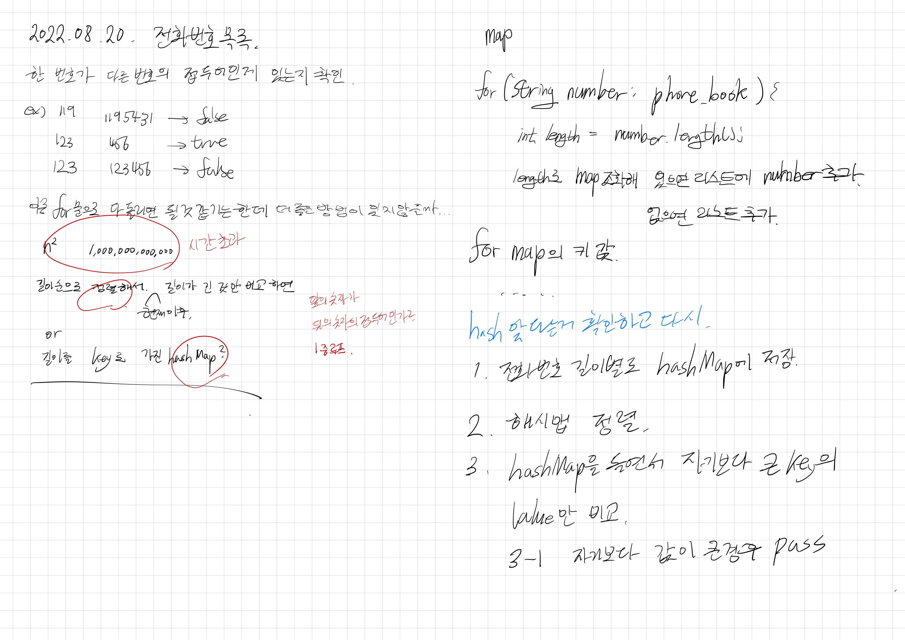

# 2022.08.20.

## 전화번호 목록

[전화번호 목록](https://school.programmers.co.kr/learn/courses/30/lessons/42577)

이증 for 문으로 다 돌리면 풀긴 하겠는데, 시간 초과 날 것 같다.

정렬해서 하면 좀 더 효율적으로 할 수 있지 않을까?

그냥 해시 이용하면 더 편할 것 같은데?

근데 뭔가 해시는 너무 간건가 싶어서, 구현하다가 강의를 봤다.

신기하게 생각하는 과정이 비슷했다.

아이디어가 맞는걸 확인하고 정리했다.

내일 구현 해야지