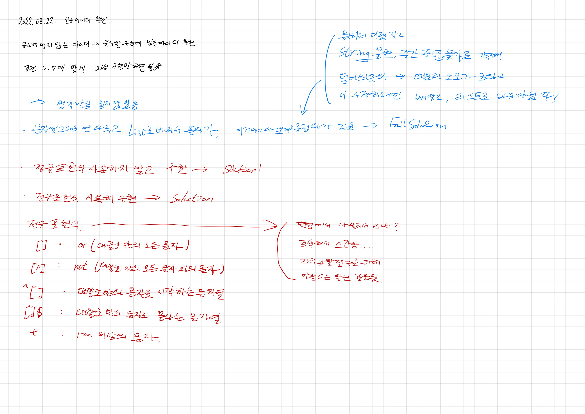

# 2022.08.22.

## 신규 아이디 추천

[신규 아이디 추천](https://school.programmers.co.kr/learn/courses/30/lessons/72410)

그냥 구현 하면 되겠다 싶었는데 원하는 결과 만들기 쉽지 앟았음

## 강의

[강의](https://www.youtube.com/watch?v=KGmuGWMzXx8)

현업 - 정규 표현식 외우지않고 구글링해가면서 사용

코테 - 검색 못하는 경우 있을 수 있으니까. 두 가지 방법으로 풀이

## 정규 표현식

https://docs.oracle.com/javase/8/docs/api/java/util/regex/Pattern.html#sum

찾은 방법: java 8 replaceall -> replace all -> regular expression

추가

https://boilerplate.tistory.com/53

어떤 역할인지는 찾을 수 있었는데 어떻게 사용하는지 공식문서에서 못 첮았음

[] 로 패턴을 정해주고.

| : or

^ : 맨 앞

$ : 맨 뒤

+ : 해당 패턴 반복