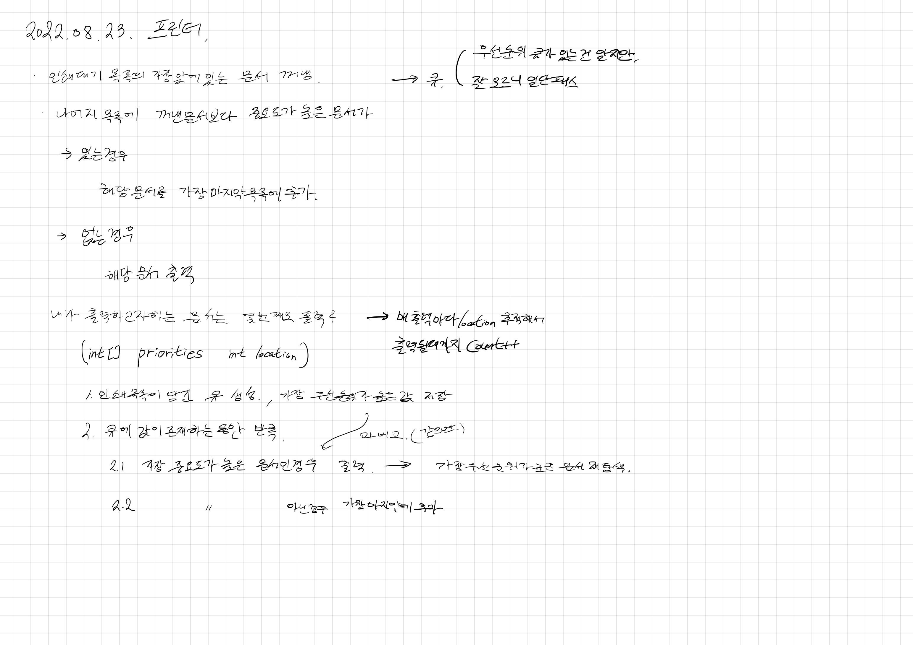

# 2022.08.23.

## 프린터

[프린터](https://school.programmers.co.kr/learn/courses/30/lessons/42587?language=java)

아침에 안 풀고 갔으니까 간단하게 풀고 자야지 하다가 1시가 넘었다.

끙끙대다가 오기가 생겨서 답 안보고 계속 구현했다.

그러다가 이건 아닌 것 같아서, 마음을 다잡고,

내가 구현하려 하는 것을 경우를 나눴다.

프린터가 출력 될 경우 (원하는 문서O, 원하는 문서X)

프린터가 출력 안 될 경우 (원하는 문서O, 원하는 문서X)

경우를 확실하게 나누고 부분부분 구현하니까 구현 됐다.

내일은 강의 보고 더 나은 풀이를 고민해 봐야겠다.

[강의](https://www.youtube.com/watch?v=cdgZ-lhHatM)