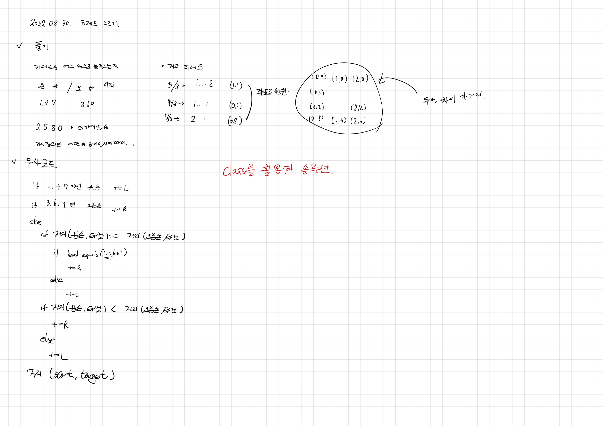

# 2022.08.30.

## 키패드 누르기

[키패드 누르기](https://school.programmers.co.kr/learn/courses/30/lessons/67256)

## 강의

[강의](https://www.youtube.com/watch?v=jFv2LRVCK6s)

로직 짤 때 현재 위치를 고려 못 했는데 클래스로 이렇게 구현할 수도 있구나 싶었다.

되게 편하게 구현한다...

똑같이 밑바닥 부터 구현은 못하겠는데 일단 여러 문제 경험해 봐야겠다.
