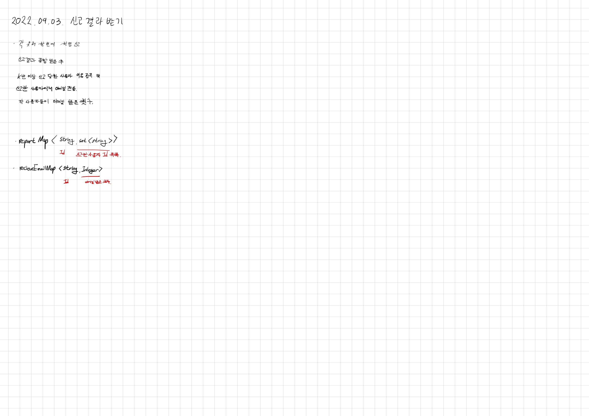

# 2022.09.03.

## 신고 결과 받기

[신고 결과 받기](https://school.programmers.co.kr/learn/courses/30/lessons/92334)

전에 풀었던 문제인데 그때는 class 를 만들어서 풀었었다.

어거지로 푼 것 같은 기분이 들었었는데 이번에는 SET 이용해서 좀 더 효율적으로 풀이한 기분이 들었다.

어떤 과정을 거쳐야할지 순차적으로 생각하니까 쉽게 풀렸다.