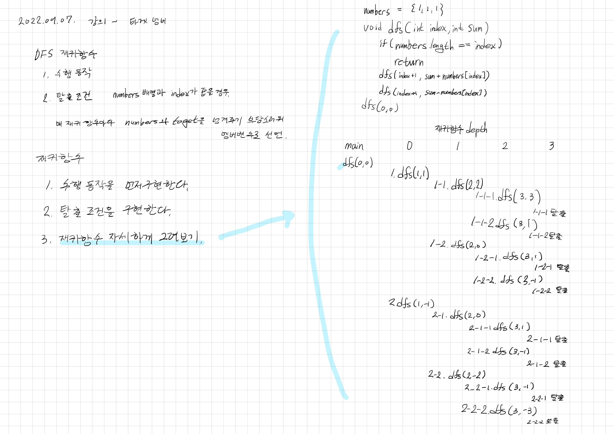

# 2022.09.07.

## 타겟 넘버

[타겟 넘버](https://school.programmers.co.kr/learn/courses/30/lessons/43165?language=java)

[강의](https://www.youtube.com/watch?v=S2JDw9oNNDk)

## 재귀 함수

1. 수행 동작을 먼저 구현한다.
2. 탈출 조건을 구현한다.
3. 재귀 함수에 대해 자세하게 그려보기

