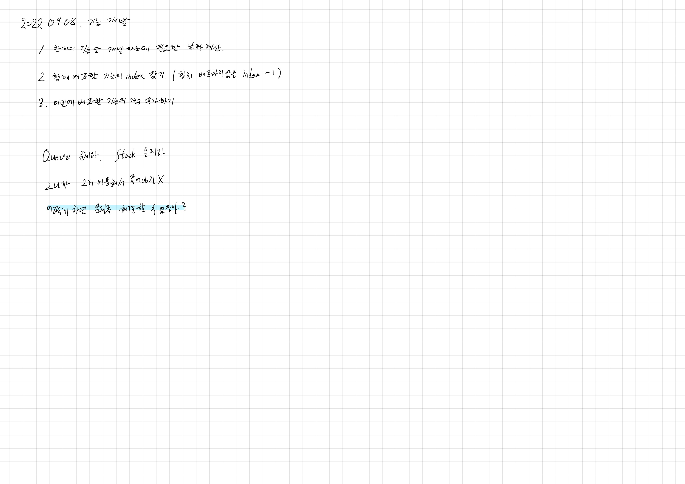

# 2022.09.08.

## 기능 개발

[기늘 개발](https://school.programmers.co.kr/learn/courses/30/lessons/42586)

[강의](https://www.youtube.com/watch?v=IxrMbl1w4RA)



```
double days = (100 - progresses[i]) / (double) speeds[i];
```

하나 이상이 double 형이어야 함

```
int j = i + 1;
for (; j < progresses.length; j++) {
```

for 문 밖에서도 사용하기 위해

```
j - 1 - i + 1
```

j : 같이 배포할 수 없는 첫 인덱스

j-1 까지 같이 배포할 수 있음

```
i = j - 1;
```

j-1 까지 배포했으니 다음은 j 부터 시작해야함

i++ 후 다음 반복문이 시작하므로

j-1


```
return answer.stream().mapToInt(i -> i.intValue()).toArray();
```
1중이라 for 문으로 돌려도 되지만 스트림 활용
