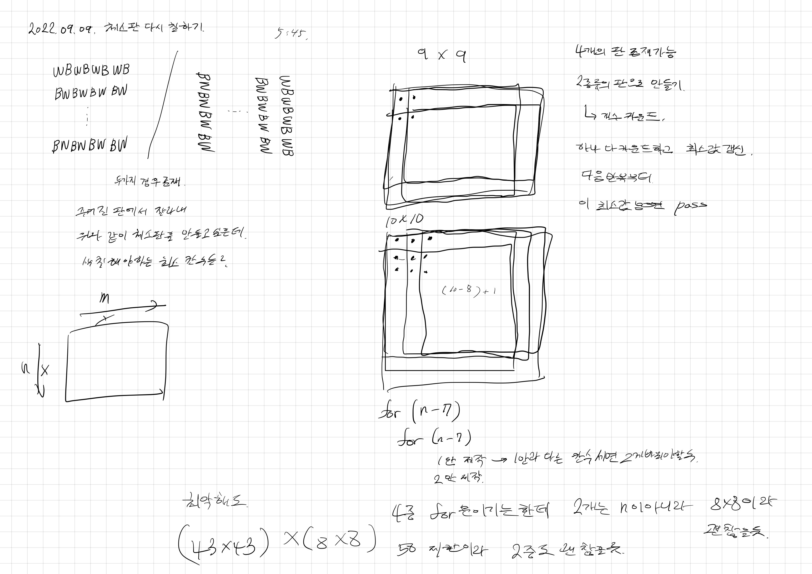

# 2022.09.09.

## 체스판 다시 칠하기

[체스판 다시 칠하기](https://www.acmicpc.net/problem/1018)



단순 무식한 방법으로 구현해서 풀었다.

## 강의

[강의](https://www.youtube.com/watch?v=QQUb4b6iWSw)

강의를 살짝 봤는데 이렇게도 되는구나 싶어서 재밌었다.

### 체스판

* 나

```
char[][] board
board[i] = br.readLine().toCharArray();
...
if (chessBoard1[y][x] != board[dy][dx]) {
```

배열에 담아서 비교

* 강의

```
Strint[] board
board[i] = sc.nextLine();
...
if (board[row].charAt(col) != orgBoard[row%2].charAt(j))
```

String 에 담고, charAt 으로 비교

### 체스판 비교

* 나

```
char[][] chessBoard1 = {
        {'W', 'B', 'W', 'B', 'W', 'B', 'W', 'B'},
        ...
        {'B', 'W', 'B', 'W', 'B', 'W', 'B', 'W'}
};
...
chessBoard1[y][x]
```

8줄 모두 표현

* 강의

```
String[] orgBoard = {"WBWBWBWB", "BWBWBWBW"};
...
orgBoard[row%2]
```

사용할때 %2 로 동일한 효과

### 보드판 종류

* 나

```
char[][] chessBoard1 = {..}
char[][] chessBoard2 = {..}

chessBoard1 (만드는데 바꿔야할 칸 개수 확인)
chessBoard2
```

동일 코드 두 번 반복

* 강의

```
String[] orgBoard = {"WBWBWBWB", "BWBWBWBW"};

min(화이트 보드판, 64 - 화이트 보드판)
```

둘의 관계를 찾아내 중복 계산 줄임
