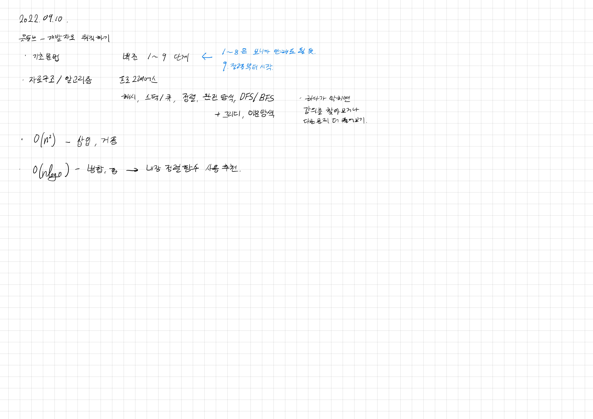
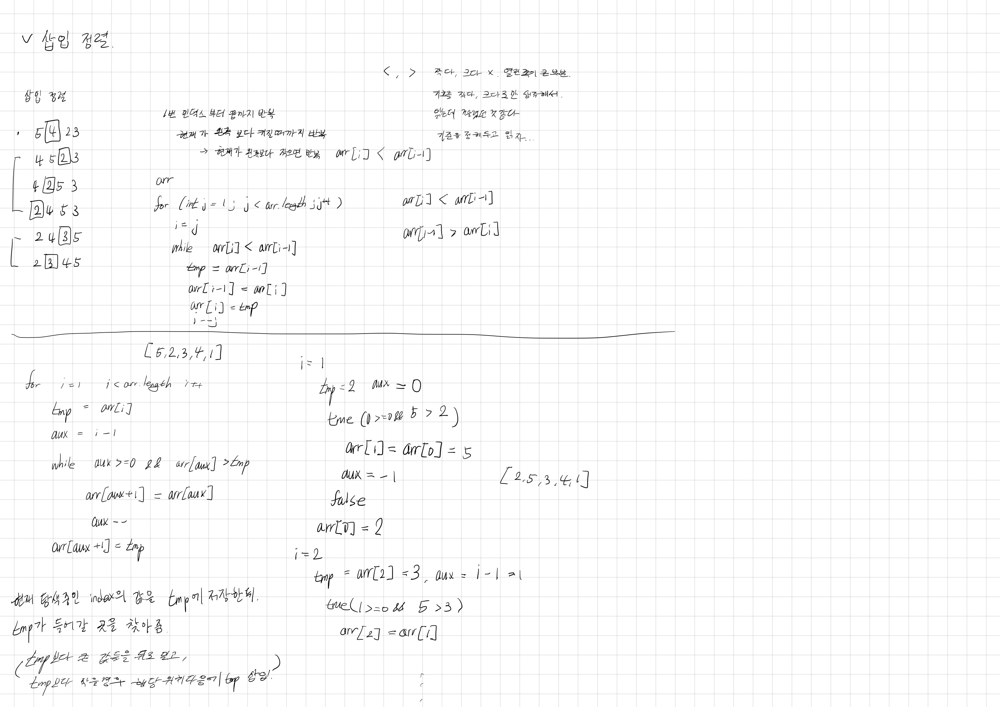

# 2022.09.10.

## 공부 진행 방향

유투브의 개발자로 취직하기 채널의 풀이를 다 봤다.

문제에 이렇게 접근하는구나, 이렇게 생각하고 구현하는구나 많이 느꼈다.

영상이 더 없어서 이제 뭐하지 하며 살짝 아쉬웠는데

공부 방법 추천해주신 영상이 있어서 그대로 해보려고 한다.



백준 정렬 부터 시작..!

## 삽입 정렬



* 처음 구현

```
for (int i = 1; i < n; i++) {
    int pivot = i;
    while (pivot > 0 && arr[pivot] < arr[pivot - 1]) {
        int tmp = arr[pivot - 1];
        arr[pivot - 1] = arr[pivot];
        arr[pivot] = tmp;
        pivot--;
    }
}
```

* 위키피디아 구현

```
for(int index = 1 ; index < arr.length ; index++){
    int temp = arr[index];
    int aux = index - 1;

    while( (aux >= 0) && ( arr[aux] > temp ) ) {
        arr[aux + 1] = arr[aux];
        aux--;
    }
    arr[aux + 1] = temp;
}
```

처음 위키피디아 코드가 이해가 안 돼

값이 어떻게 변하는지 하나씩 다 그려봤다.

조금 그리니까 어떤 식으로 진행되는 건지 눈에 들어왔다.

나는 매번 자리를 바꾸지만,

이 경우는 삽입할 값을 정하고 따로 저장해 둔 후

인덱스를 하나씩 줄이면서 삽입할 위치를 찾는다.

큰 경우 하나씩 뒤로 밀고

작은 경우 그 다음 인덱스에 삽입한다.

나는 두번 자리 교체를 했고 여긴 한번만 교체했다.

문제 기준으로 메모리랑 시간 차이는 별로 없기는 했다.

기억 안나면 위에거로, 난다면 아래거로!

## 부등호

나는 부등호가 있을떄 뇌정지가 올떄가 있다..

가뿐하게 넘어갈때가 대부분이긴 한데 한번 걸리면 좀 심하게 걸린다.

어렸을떄부터 그랬다.

근데 이걸 공부해야 돼? 하고 근본을 무시하고 넘어갔다.

그랬더니 지금까지 이러고있다.

모르는게 문제가 아니라 모르면서 아는척하는게 문제다.

이 기회에 어디서 막히는지를 찾아봤다.

```
1. = 는 같다 처럼 < 는 크다, > 는 작다로 읽으려 했다.

2. A보다 B가 작으니까 A가 B보다 작으니까, B가 A보다 크니까, B보다 A보다 크니까

이런 식으로 안녕도 계속하면 어색하듯이 말에서 오는 거에서 막히고 있었다.

3. while 문 조건에서 자주 뇌정지가 왔다.

while True:
  if ~
    break

이런식으로 써버릇해서 반복 조건 보다 탈출 조건으로 생각하게 된 것 같다.

while 문 조건은 조건이 참 -> 반복 / 거짓 -> 탈출

탈출 조건이 아니라 반복 조건임.

-> 10번 반복하려면,

10보다 크면 정지... 로 생각하는게 아니라

10보다 작을 경우 반복... 으로 생각하니까 편하다.
```