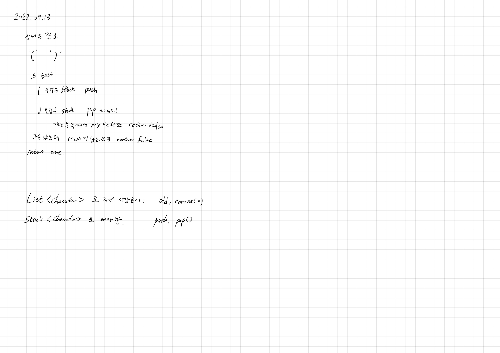

# 2022.09.13.

## 폰켓몬

[폰켓몬](https://school.programmers.co.kr/learn/courses/30/lessons/1845)

1단계

## 올바른 괄호

[올바른 괄호](https://school.programmers.co.kr/learn/courses/30/lessons/12909)

list 에서 add, remove 하는 것 보다

stack 에서 push, pop 하는 것이 빠르다.

## TIL

학교 가기전에 시간이 애매해서 간단한 문제만 풀었다.