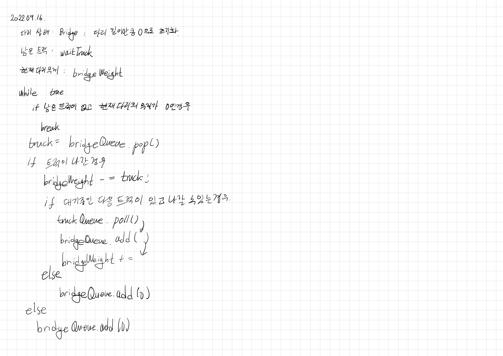

# 2022.09.16.

## 다리를 지나는 트럭

[다리를 지나는 트럭](https://school.programmers.co.kr/learn/courses/30/lessons/42583)



태블릿으로 코드를 쳤다... 시간도 오래 걸리고 눈에도 안들어 왔다.

전보단 괜찮아 진 것 같기는 한데... 키보드를 하나 살까? 고민되네.

직접 구현해 보니까 생각처럼 되지는 않았다.

트럭이 다리에서 나올때만 새 트럭을 다리에 배치하게 짜서 오류가 났었다.

매 반복마다 새 트럭을 다리에 배치할 수 있도록 변경해서 성공 했다.

## while 문

AS-IS

```
while (true) {
    if (truckQueue.isEmpty() && bridgeWeight == 0) {
        break;
    }
    ...
}
```

TO-BE

```
while (!truckQueue.isEmpty() || bridgeWeight != 0) {
    ...
}
```

나는 재귀함수 종료 조건 짜듯이

```
if 탈출 조건
    break
```

이렇게 코딩하는게 편하다.

전부터 그냥 while 문에 바로 짜야지... 라는 생각으로

while 문을 짤때 마다 뇌정지랑 내적 갈등이 왔다.

근데 그냥 if break 로 짜고 부정한번만 해주면 간단하게 해결되는 문제였다.

이렇게 짜다보면 더 익숙해지면 바로 짤 날이 오겠지.