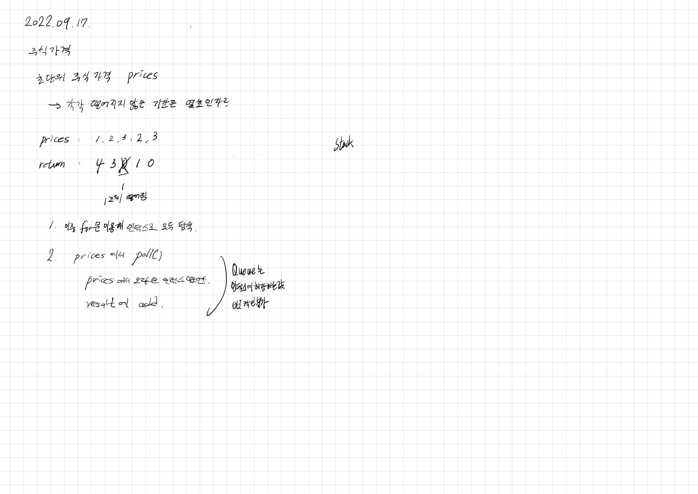

# 2022.09.17.

## 주식 가격

[주식 가격](https://school.programmers.co.kr/learn/courses/30/lessons/42584#)

자료구조 이용해서 풀려다가 안되서 그냥 이중 for 문으로 돌았다.



## 스택?

스택 풀이를 읽어봐도 모르겠다.... 그래서 진짜 빠른가 비교해봤는데 더 느리다?

굳이 안보고 넘어가도 되겠다.

리스트

```
테스트 1 〉 통과 (8.81ms, 68.1MB)
테스트 2 〉 통과 (11.74ms, 64.3MB)
테스트 3 〉 통과 (14.86ms, 68.3MB)
테스트 4 〉 통과 (10.58ms, 65.7MB)
테스트 5 〉 통과 (10.01ms, 66MB)
```

스택

```
테스트 1 〉 통과 (38.96ms, 73.5MB)
테스트 2 〉 통과 (29.38ms, 69.1MB)
테스트 3 〉 통과 (46.79ms, 74.9MB)
테스트 4 〉 통과 (33.29ms, 66.6MB)
테스트 5 〉 통과 (25.35ms, 62.6MB)
```

## 큐

처음엔 큐 이용해서 풀어보려고 했다.

그러다가 새로 알게 된 것들 있어서 정리 했다.

```
// List<Integer> ints = new ArrayList<>(Arrays.asList(prices)); // asList 기본형 타입 지원하지 않음

Queue<Integer> queue = new LinkedList<>(Arrays.stream(prices).boxed().collect(Collectors.toList())); 
```
