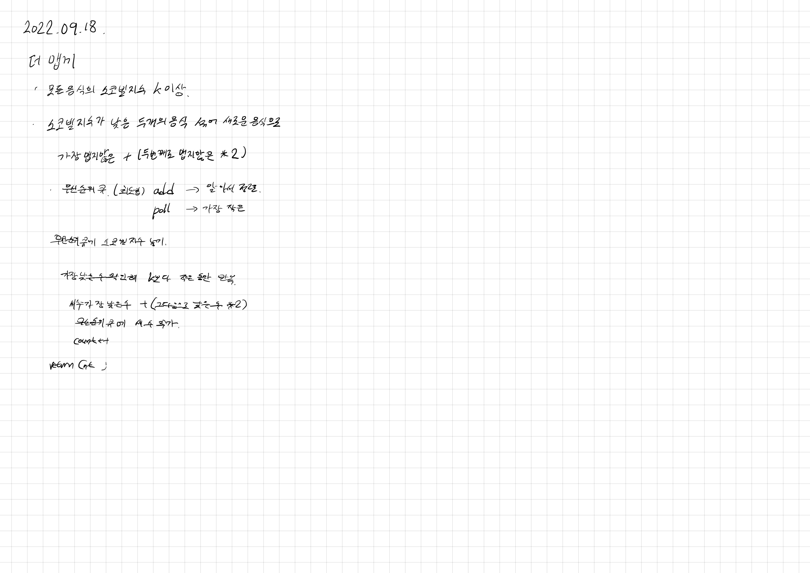

# 2022.09.18.

## 더 맵게

[더 맵게](https://school.programmers.co.kr/learn/courses/30/lessons/42626?language=java)

전에 파이썬으로 풀었었는데,

그떄도 아 우선순위 큐라는게 있구나, 그거 이용해서 구현하면 되는구나 정도로 끝내고 넘어갔다.

프로그래머스 카테고리 별로 푸는 중인데 힙이 들어는 봤는데 뭐지? 싶어서 다시 풀게 됐다.



## 우선 순위 큐

힙으로 구현 된 자료 구조

우선 순위를 결정하고 우선 순위가 높은 엘리멘트가 먼저 나가는 구조

* 최대 힙 : 큰 값이 우선 순위인 큐

```
PriorityQueue<Integer> priorityQueue = new PriorityQueue();
```

* 최소 힙 : 작은 값이 우선 순위인 큐

```
PriorityQueue<Integer> priorityQueue = new PriorityQueue(Collections.reverseOrder());
```

추가

```
priorityQueue.add()
priorityQueue.offer()
```

삭제, 조회

```
// 비어 있을 경우 예외 발생
priorityQueue.remove()
priorityQueue.element()


// 비어 있을 경우 null 
priorityQueue.poll()
priorityQueue.peek()
```

[참고 자료](https://velog.io/@gillog/Java-Priority-Queue우선-순위-큐)

## 힙

완전 이진트리로 구현한 자료 구조

삽입 -> 힙의 조건 만족할 떄까지 스왑
