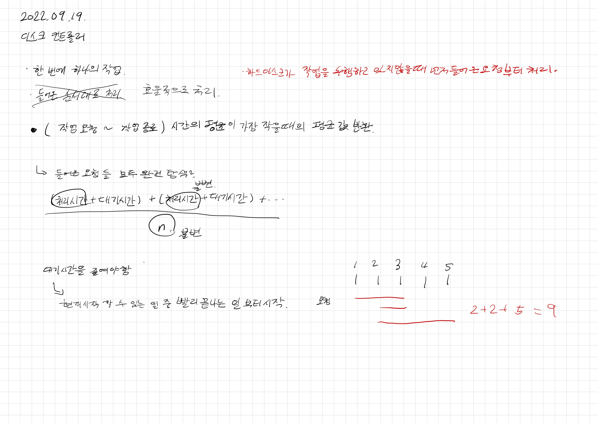
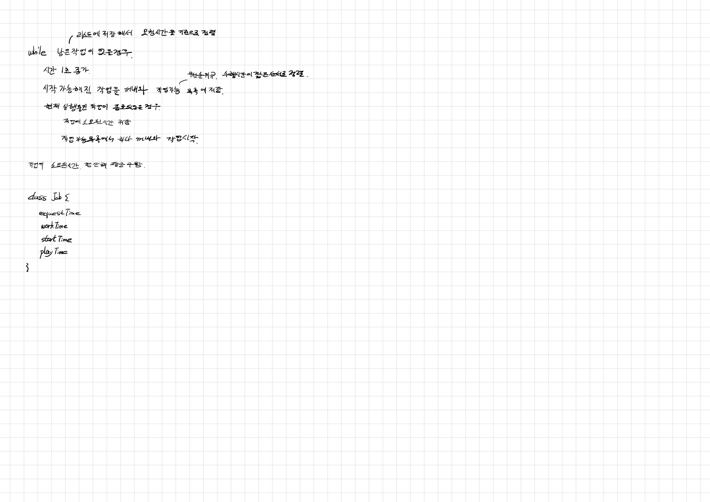

# 2022.09.19.

## 디스크 컨트롤러

[디스크 컨트롤러](https://school.programmers.co.kr/learn/courses/30/lessons/42627)

테스트 케이스는 맞는데 왜 안 될까...

이 문제 구현하는데 2시간 넘게 걸렸다.

왜 그랬을까....

3단계 확실히 어렵네... 

현재 상태에서 빨리 끝나는 일부터 시작하는게 틀린 전제였나?

일단 너무 오래 걸려서 다른 할일 하고 내일 이어서 해야겠다.