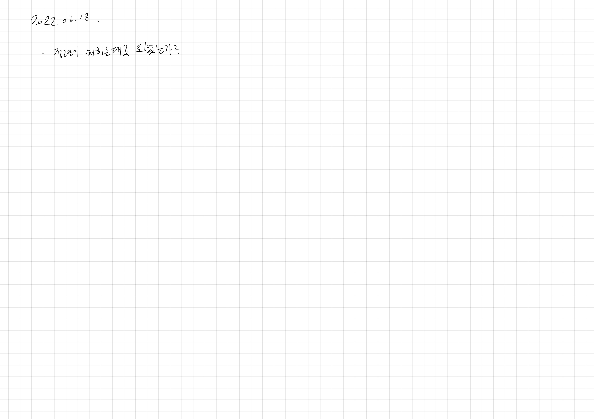

# 2022.09.20.

## 디스크 컨트롤러

[디스크 컨트롤러](https://school.programmers.co.kr/learn/courses/30/lessons/42627)

음? 힌트 모음집 테케는 틀렸는데 통과 했네?

근데 로직상 8 초가 맞기는 함

결과를 개수로 나눠 줬어야 됐느데 3으로 깡으로 나눠줬다.

가능한 작업이 없지만 실행할 작업은 남았을 경우 시간 증가를 안해줘서 시간 초과가 났다.

위의 잘 못된 점을 수정하고 통과 했다!

우선 순위 큐를 이렇게 쓰는구나 싶었다.

