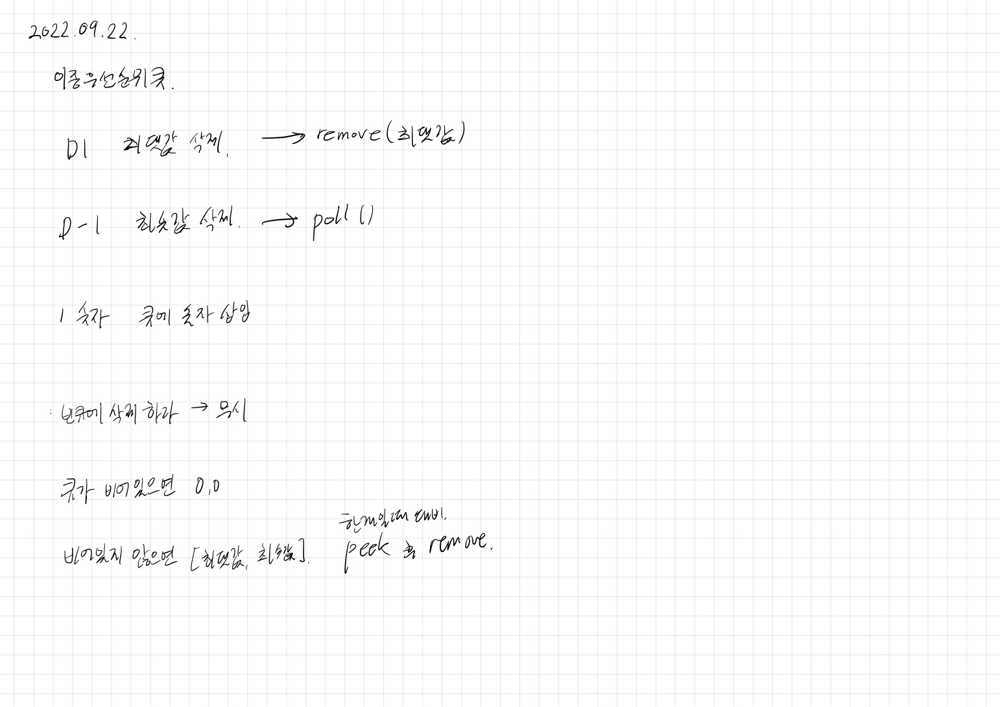

# 2022.09.22.

## 이중우선순위큐

[이중우선순위큐](https://school.programmers.co.kr/learn/courses/30/lessons/42628)



너무 쉽게 풀렸다.

근데 이건 max min 일 경우에만 풀리는 풀이 같아 어딘가 찜찜했다.

* max 초기값, 큐가 비어 있는 경우

AS-IS

```
int max = Integer.MIN_VALUE;
```

인자 중에 저 값이 있으면 어떡하지 라는 생각에 변경

TO-BE

```
Integer max = null.
```

* 메서드

중복된 부분 그냥 작성하고 통과한 뒤에 메서드로 추출했다.

AS-IS

```
if (priorityQueue.isEmpty()) {
    max = null;
} else {
    max = priorityQueue.stream().max((i1, i2) -> {
        return i1 - i2;
    }).get();
}
```

TO-BE

```
private Integer getMax(PriorityQueue<Integer> priorityQueue) {
    Integer max = null;
    if (!priorityQueue.isEmpty()) {
        max = priorityQueue.stream()
                .mapToInt(v -> v)
                .max()
                .orElseThrow(NoSuchElementException::new);
    }
    return max;
}
```

함수로 추출하면서 로직이랑 스트림도 정리했다.
