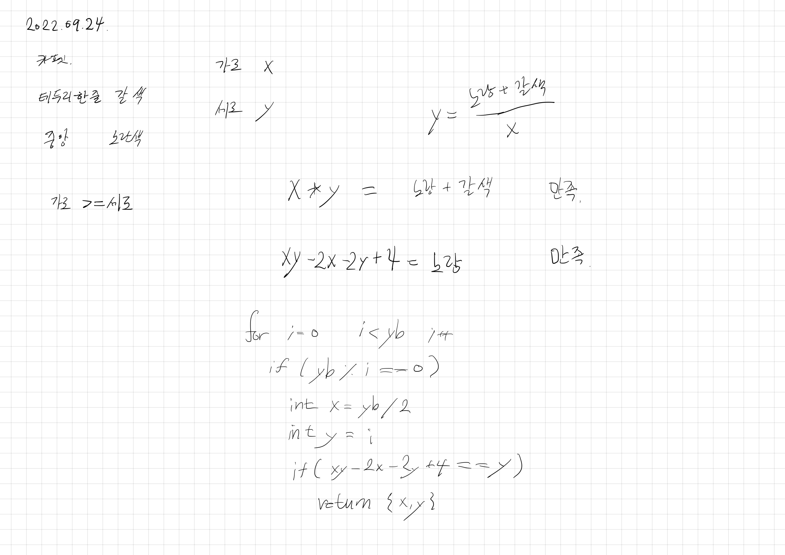

# 2022.09.24.

## 카펫

[카펫](https://school.programmers.co.kr/learn/courses/30/lessons/42842)

완탐으로 간단하게 풀 수 있는 문젠데 심심해서 계산식 구해서 풀어봤다.

오랜만에 이런거 하니까 재밌네.... 2차 방정식까지는 재밌었던 것 같은데...

근데 이러면 남는게 없을 것 같아 완전 탐색으로도 풀어 봤는데 이것도 남는게 없는 것 같다.

아 과제 테스트하며 없어진 재미 다시 찾았다.
