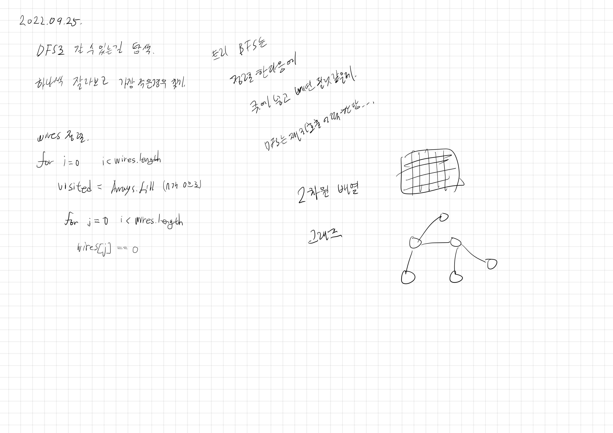

# 2022.09.25.

## 전력망을 둘로 나누기

[전력망을 둘로 나누기](https://school.programmers.co.kr/learn/courses/30/lessons/86971)

완전 탐색 그냥 하면 되겠지 했는데 막상하려니까 막혔다.

다른 코드를 사람들 코드를 봐도 이해가 잘 안됐다.

전에 이코테 책 보면서 풀었던거 다시 봐야겠다.