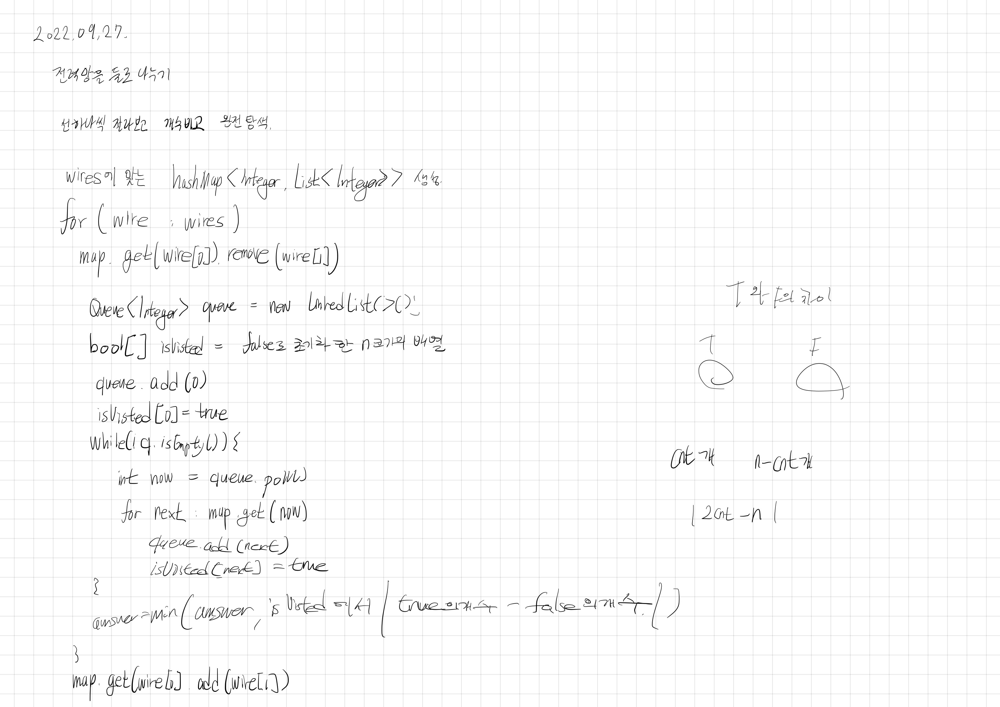

# 2022.09.27.

## 전력망을 둘로 나누기

[전력망을 둘로 나누기](https://school.programmers.co.kr/learn/courses/30/lessons/86971)



n 이 작을 경우를 체크하지 않아서 숫자 제대로 카운트 못 함

```
for (int key : map.keySet()) {
    if (map.get(key).contains(now)) {
        queue.add(key);
        isVisited[key] = true;
    }
}

```

추가해도 무한 루프 발생

방향이 없는데.. 이렇게 하면 방향이 있는 것 처럼 된다....

배열 이용해서 구현해 볼까 싶다.