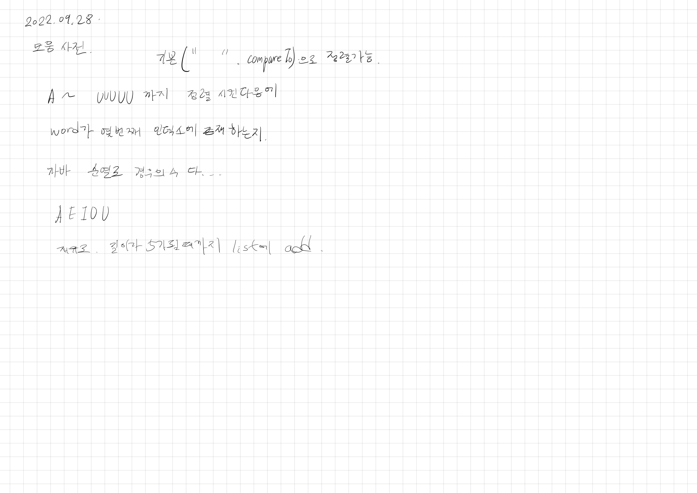

# 2022.09.28.

## 모음 사전

[모음 사전](https://school.programmers.co.kr/learn/courses/30/lessons/84512?language=java)

쉬운 문제가 최고야...

만들 수 있는 순열 다 만들어서 정렬하고 몇 번째인지 찾았다.

2단계는 쉽고 3단계는 또 너무 오래 걸리는데...

그래도 이제 3단계 풀어야겠다.