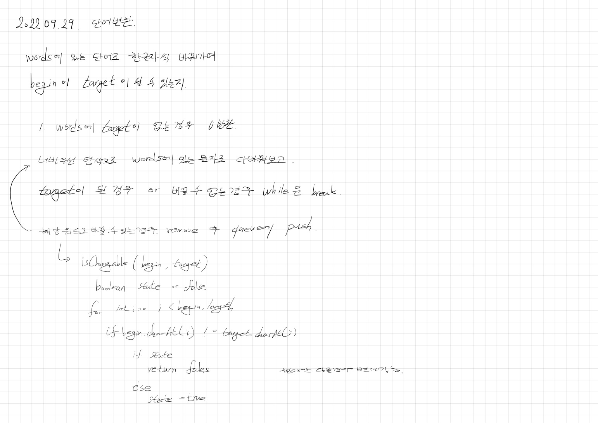

# 2022.09.29.

## 단어 변환

[단어 변환](https://school.programmers.co.kr/learn/courses/30/lessons/43163?language=java)



전에 Python 으로 풀었던 것 한 번 읽어 보고 Java 로 풀었다.

아이디어를 보고 나니 쉽게 풀었는데 처음에 이걸 어떻게 풀었지 싶다.

### Array to List

* AS-IS

```
List<String> list = Arrays.asList(words); 
```

asList 로 생성한 리스트는 변경하려 할 경우 UnsupportedOperationException 발생

고정 되어 원소 제거 불가능

* TO-BE

```
List<String> list = Arrays.stream(words).collect(Collectors.toList());
```

### List 원소 삭제 + 반복문

* AS-IS

```
for (String str : list) {
    if (isChangeable(nowName, str)) {
        queue.add(new Word(str, nowDepth + 1));
        list.remove(str);
    }
}
```

반복문의 기준이 되는 리스트에서 원소 삭제하면 원하는대로 처리하기 힘듦.

* TO-BE

```
List<String> changeableList = new ArrayList<>();
for (String str : list) {
    if (isChangeable(nowName, str)) {
        changeableList.add(str);
    }
}

for (String str : changeableList) {
    queue.add(new Word(str, nowDepth + 1));
    list.remove(str);
}
```

리스트 추가 생성 해서 위의 문제 해결

반복시 인덱스 ++ 하고 삭제 시 -- 하는 방법도 있음