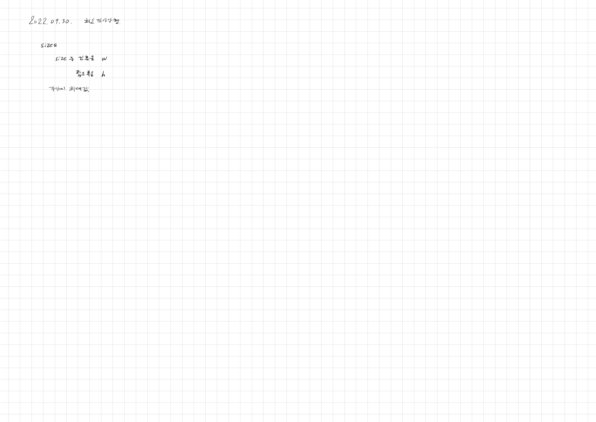

# 2022.09.30.

## 최소 직사각형

[최소 직사각형](https://school.programmers.co.kr/learn/courses/30/lessons/86491)

프로그래머스 고득점 킷 출제 빈도 높은거 다 풀어보려고 하는데

완전탐색에 1단계가 있는데 쉬워 보여서 안풀고 있었다.

그러고 있다가 오늘 뭐 하나 만드는데 시간 조절을 못해 문제 풀 살짝 시간이 부족해서

빨리 풀려고 풀었다가 죄책감이 들어 코드 정리까지 했다...
