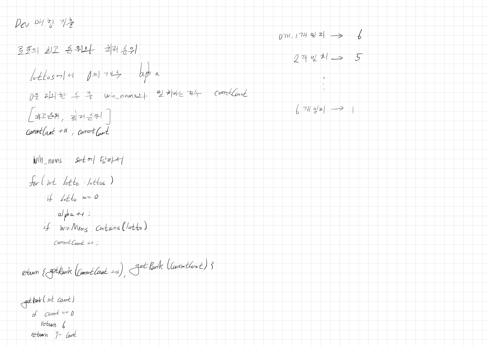
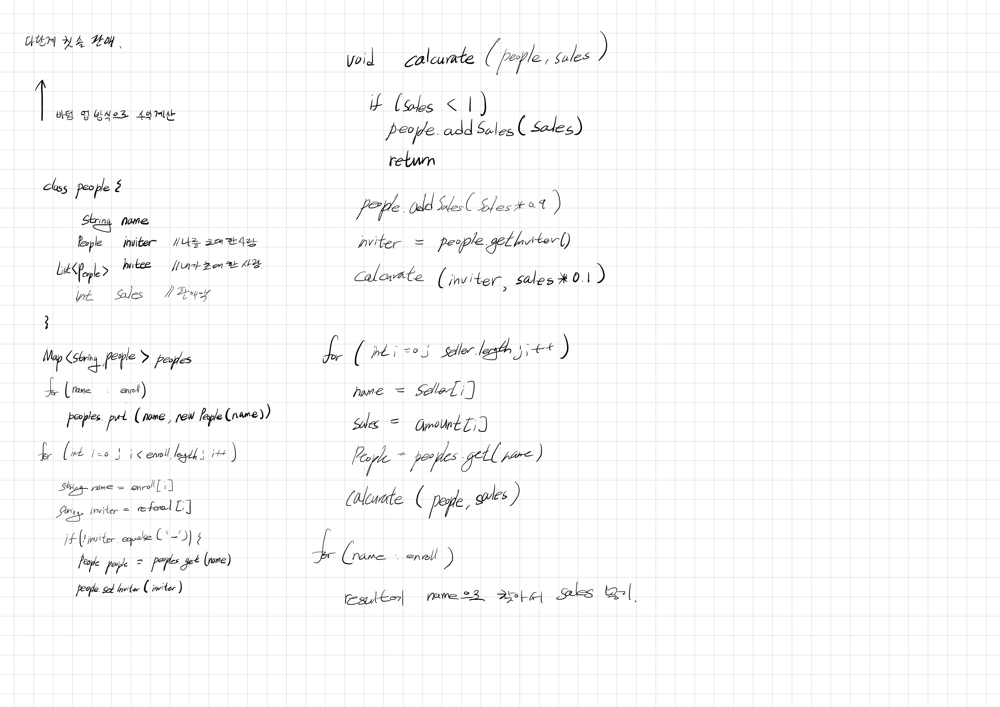
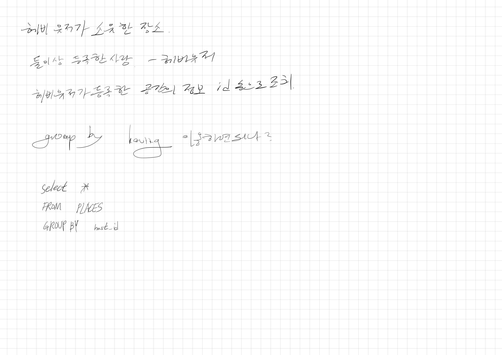

# 2022.10.01.

# 프로그래머스 데브 매칭 기출 풀이

[문제](https://school.programmers.co.kr/learn/challenges?page=1&partIds=21366)

## 로또의 최고 순위와 최저 순위(1단계)

## 행렬 테두리 회전하기(2단계)

경계값 신경 써야하는게 3단계 문제 보다 더 까다로운 느낌

## 다단계 칫솔 판매(3단계)

풀이를 위한 알고리즘이 어렵다기 보다

구현할 때 신경 쓸 부분이 많아 복잡하고 오래 걸리는 느낌 이었다.

## 헤비 유저가 소유한 장소(3단계)

3단계 라는데 SQL 문제가 쉽네. 제일 먼저 풀어야겠다.

