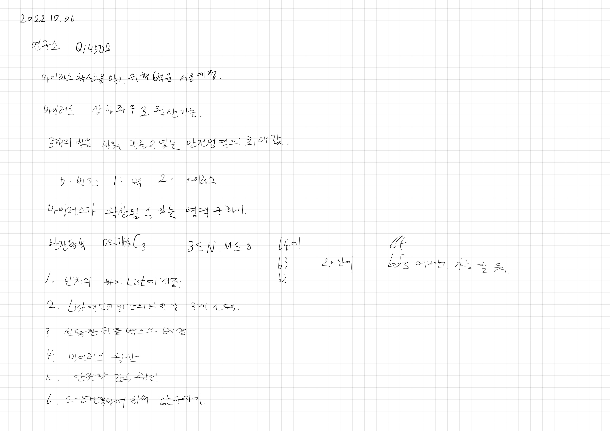

# 2022.10.06.

## 연구소

[연구소](https://www.acmicpc.net/problem/14502)



진짜 아침 부터 학교 가는길, 집가는 길에 풀었다.

처음 문제를 작은 문제로 나누고 구현하기만 하면 되겠다는 믿음이 생겼을 떄 행복했다.

구현이 될 듯 안되어 아쉬웠다.

학교 가면서 한 시간 정도 더 했는데 안 됐을 때 슬슬 피곤하기 시작했다.

그래도 내가 맞다는 것을 증명하고 싶어서 끝까지 풀었다.

디버깅 툴로 잘 못된 부분을 하나씩 찍어가면서 수정했다.

## 풀이

* 조합으로 같은 값만 가져와지는 문제

AS-IS

```
private static void combination(int[] comArr, int n, int r, int index, int target) {
    if (r == 0) {
        blockWallCombinations.add(comArr);
        return;
    }
```

TO-BE

```
private static void combination(int[] comArr, int n, int r, int index, int target) {
    if (r == 0) {
        blockWallCombinations.add(comArr.clone());
        return;
    }
```

조합 코드를 가져와서 살짝 변형해서 사용 했다.

실제 값이 아닌 주소 값을 넘겨줘서 생긴 문제였다.

* 바이러스 확산 문제

AS-IS

```
for (int k = 0; k < dx.length; k++) {
    for (int l = 0; l < dx.length; l++) {
        int nx = x + dx[k];
        int ny = y + dy[l];
```

TO-BE

```
for (int k = 0; k < dx.length; k++) {
    int nx = x + dx[k];
    int ny = y + dy[k];
```

상하 좌우가 아니라 대각선까지 다 탐색하고 있었다.

간단한건데 문제가 생겨서 찾는데 오래 걸렸다.

당연한 코드여도 하나의 기능 완성하고 테스트 해보고 넘어가기 
