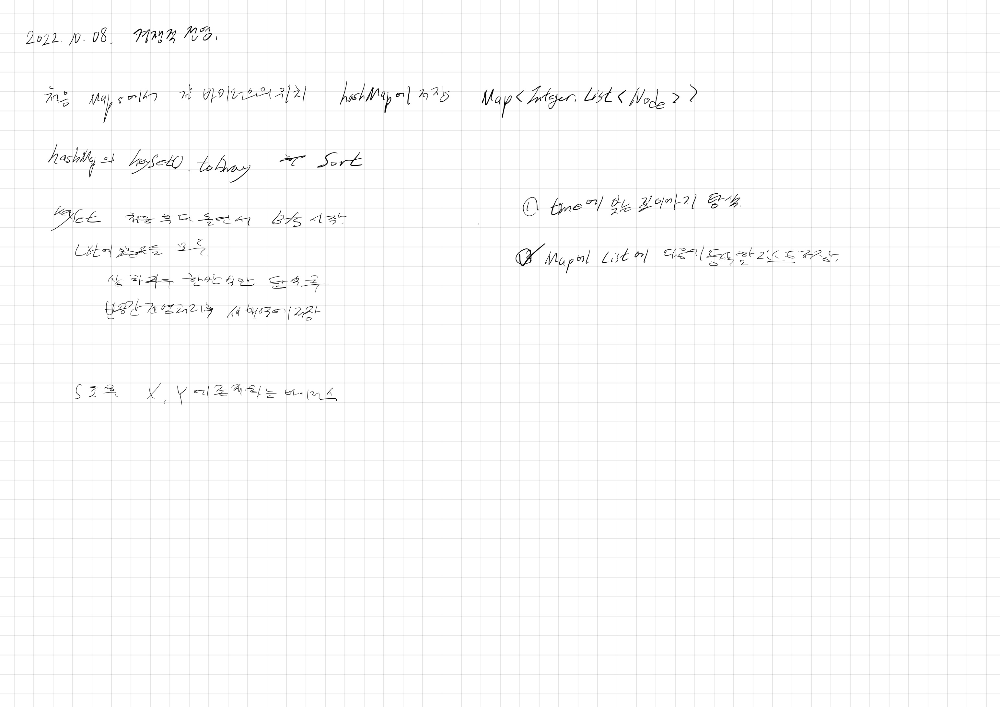

# 2022.10.08.

## 경쟁적 전염

[경쟁적 전염](https://www.acmicpc.net/problem/18405)

큰 문제를 작은 문제로 나누고, 그 작은 문제를 또 나눈 후,

하나씩 구현 하니까 정답이 었다.

아 이거 BFS 로 풀면 되겠다 했는데 하다보니

BFS 안 쓰고 그냥 단순 구현으로 풀었다.

이코테 코드 보니까 처음에 번호가 낮은대로 큐에 넣고,

BFS 돌리면 번호가 낮은 순서대로 증식하니까 따로 체크를 안해줬다.

이건 내일이나 이따가 구현 해봐야겠다.
