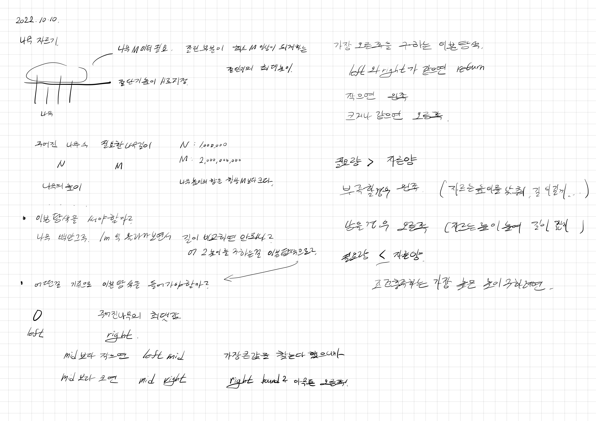
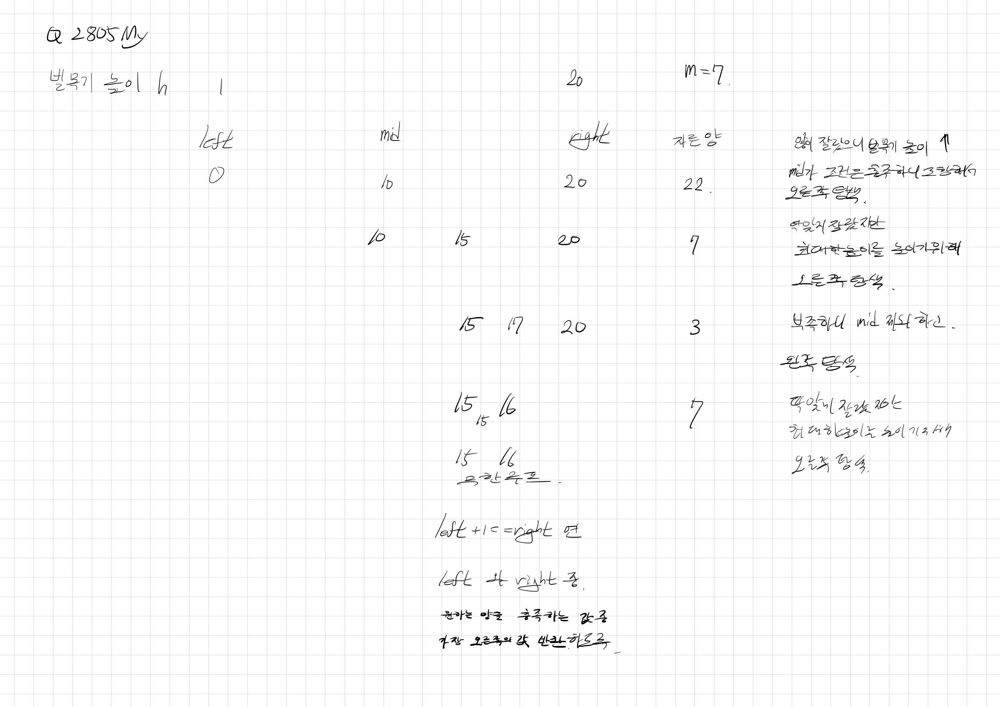
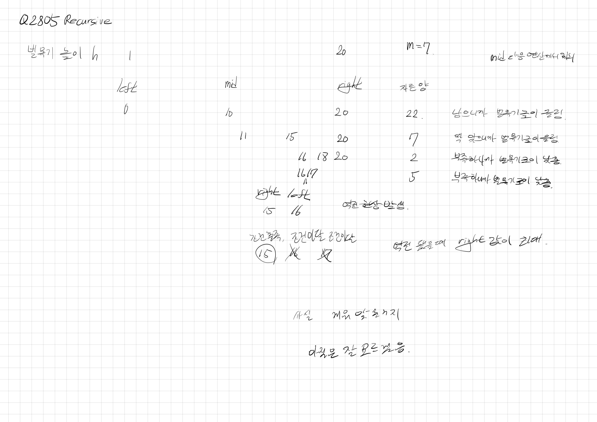

# 2022.10.10.

## 나무 자르기

[나무 자르기](https://www.acmicpc.net/problem/2805)

이진 탐색 개념은 알겠는데 종료하는게 맘처럼 안되네

억지로 구현은 했다.

근데 테스트 케이스 검색해서 디버깅하면서 끼워맞춘식이라 화난 마음 달래기용이지 딱히 의미는 없다.

내일은 자료들 찾아보면서 공부 좀 해야겠다.

* https://12bme.tistory.com/120

* https://www.acmicpc.net/blog/view/109

## 탐색 범위(left, right)

벌목기의 높이를 기준으로 탐색

left : 0

right : 가장 긴 나무의 길이

탐색 시작 범위를 1으로 지정 했다가 이거 잡느라도 꽤 걸렸다.

왜 1로 했는지는 모르겠다.