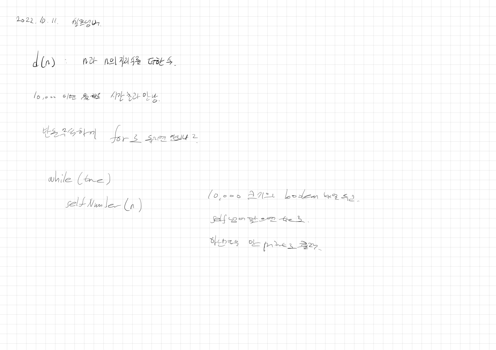

# 2022.10.11.

## 이분 탐색

아침에 공부하다 갔는데 이해를 다 못 했음

## 셀프 넘버(Q4673)

[셀프 넘버](https://www.acmicpc.net/problem/4673)



처음에는 단계별 풀이 초반에 있는 문제라 그냥 구현하면 되겠지~ 했다.

각잡고 풀려고 보니까 어 이거 어떻게 풀지? 생각이 들었다.

그래서 해봤자 10,000 이고 뭘해도 된다는 생각으로 완전탐색 돌렸다.

풀고 나니까 가뿐했다.

## 각 자리수 구해서 더하기

처음엔 자바에서만 할 수 있는 풀이로 풀었다가,

어 이거 라이브러리 없이는 어떻게 구현해야되지..? 하고 구현해봤다.

```
public static int selfNumber(int n) {
    String number = String.valueOf(n);
    for (char ch : number.toCharArray()) {
        n += ch - '0';
    }
    return n;
}
```

```
public static int selfNumber2(int n) {
    int result = n;
    while (n != 0) {
        result += n % 10;
        n /= 10;
    }
    return result;
}
```
