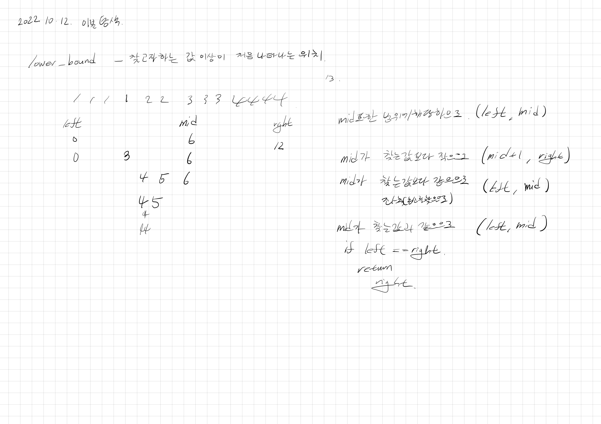
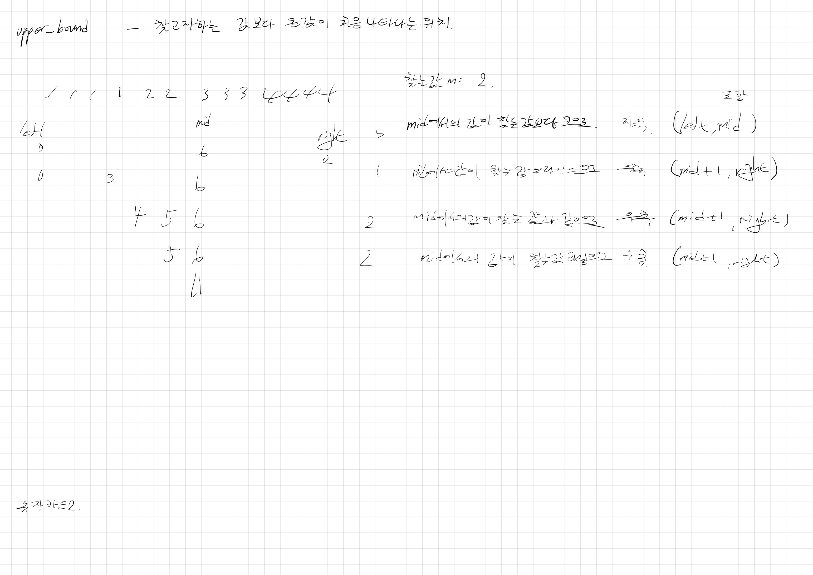

# 2022.10.12.

## 숫자 카드2

[숫자 카드2](https://www.acmicpc.net/problem/10816)

제한을 안두면 하루 종일 붙잡고 있을 것 같아.

앞으로 TIL 은 하루에 한 시간씩 이진탐색 파보기로 해야겠다.





라고 적어두고 또 한시간 더 했다.

아래처럼 진짜 자세하게 정리했더니 그리 어렵지 않았다.

좀 지나고 보니까 다시 어색하다.

익숙해지는 수 밖에 없는 것 같다.

## lowerBound, UpperBound

lowerBound : 찾고자하는 값 이상이 처음 나타나는 위치

upperBound : 찾고자하는 값 보다 큰 값이 처음 나타나는 위치

같은 값을 처리할때만 다르게 해주면 됨.

* lowerBound

    ```
    현재 탐색 중인 값이 찾고자하는 값 보다 작은 경우 현재 값의 오른쪽 탐색
    arr[mid]  < m : (mid+1, right)
    // 찾는 값 이상이 처음 나타나는 위치를 구하는데,
    // 현재 값은 찾는 값보다 작으므로 필요 없는 값이라 다음 탐색에서 제외
    
    현재 탐색 중인 값이 찾고자하는 값과 같은 경우 현재 값의 왼쪽 탐색(찾고자하는 값보다 큰 가장 작은 인덱스를 찾아야하니까)
    현재 탐색 중인 값이 찾고자하는 값 보다 큰 경우 현재 값의 왼쪽 탐색
    arr[mid] >= m : (left, mid)
    ```

    ```
    static int lowerBound(int[] cards, int card) {
        int left = 0;
        int right = cards.length;
    
        while (left < right) {
            int mid = (left + right) / 2;
            if (cards[mid] < card) {
                left = mid + 1;
            } else {
                right = mid;
            }
        }
        return right;
    }
    ```

* upperBound

    ```
    현재 탐색 중인 값이 찾고자하는 값 보다 작은 경우 현재 값의 오른쪽
    현재 탐색 중인 값이 찾고자하는 값과 같은 경우 현재 값의 오른쪽 탐색
    arr[mid] <= m : (mid + 1, right)
    // 찾는 값보다 큰 값이 처음 나오는 위치를 구하는데,
    // 현재 값은 찾는 값 보다 작거나 같으므로 필요 없는 값이라 다음 탐색에서 제외
    
    현재 탐색 중인 값이 찾고자하는 값 보다 큰 경우 현재 값의 왼쪽 탐색
    arr[mid] > m : (left, mid)
    
    ```

    ```
    static int upperBound(int[] cards, int card) {
        int left = 0;
        int right = cards.length;
    
        while (left < right) {
            int mid = (left + right) / 2;
            if (cards[mid] <= card) {
                left = mid + 1;
            } else {
                right = mid;
            }
        }
        return right;
    }
    ```