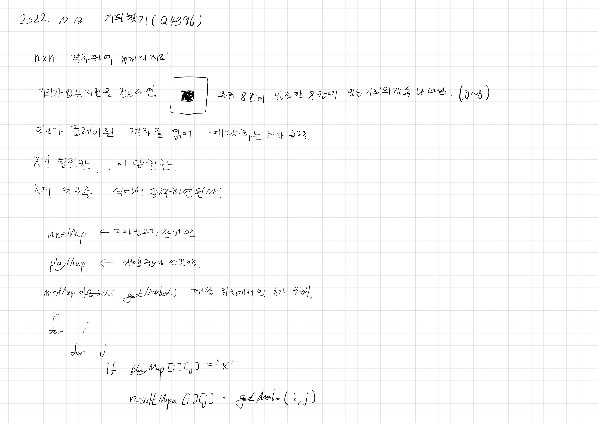

# 2022.10.13.

# 지뢰 찾기(Q4396)

[지뢰 찾기](https://www.acmicpc.net/problem/4396)

저번에 코테 볼때 문제는 이거보다 더 복잡하긴 했다.

근데 이거도 막상 풀어보니까 진짜 별거 없네...

그냥 어색한거지 어려운게 아니었다. 많이 풀어봐야지.

## 생각 정리

오늘 살짝 현타가 왔다.

학교에서 교수님이랑 얘기할 기회가 생겨 얘기를 했다.

취업 준비 하냐고 물어 보셔서 요즘 코테도 보이는 대로 지원 하고 있다고 대답했다.

그러면 최근 본 문제 중 가장 어려웠던게 뭐냐고 물어보셨다.

생각하다가 생각난게 지뢰찾기여서 당당하게 지뢰 찾기라고 말씀 드렸다.

그랬더니 엥 그게 어려워요? 그냥 배열해서 주위만 탐색하면 되는거 아닌가?

어.... 생각해보니까 그랬다. 이걸 왜 어렵다고 생각하고 있었지?

그래서 현타가 왔다. 뭔가... 열심히는 살았는데. 꾸준히는 해왔는데 아직 많이 부족한 느낌.

아직도 이 자리인가? 싶은 느낌이 들었다.

집가는 길에 지하철 타기전에 하천에서 초코바 좀 먹으면서 강 좀 보다가 헬스 하고 집에 들어갔다.

이게 난데 어떡하겠나 싶다.

그래도 처음 시작했을때보다는 훨씬 성장했으니까,

아직 원하는 내가 아니어도 계속 할거다.

이런 감정을 느낄 때일 수록 더 제대로 해 증명해내서 근거 있는 자신감 있는 사람이 돼야지.