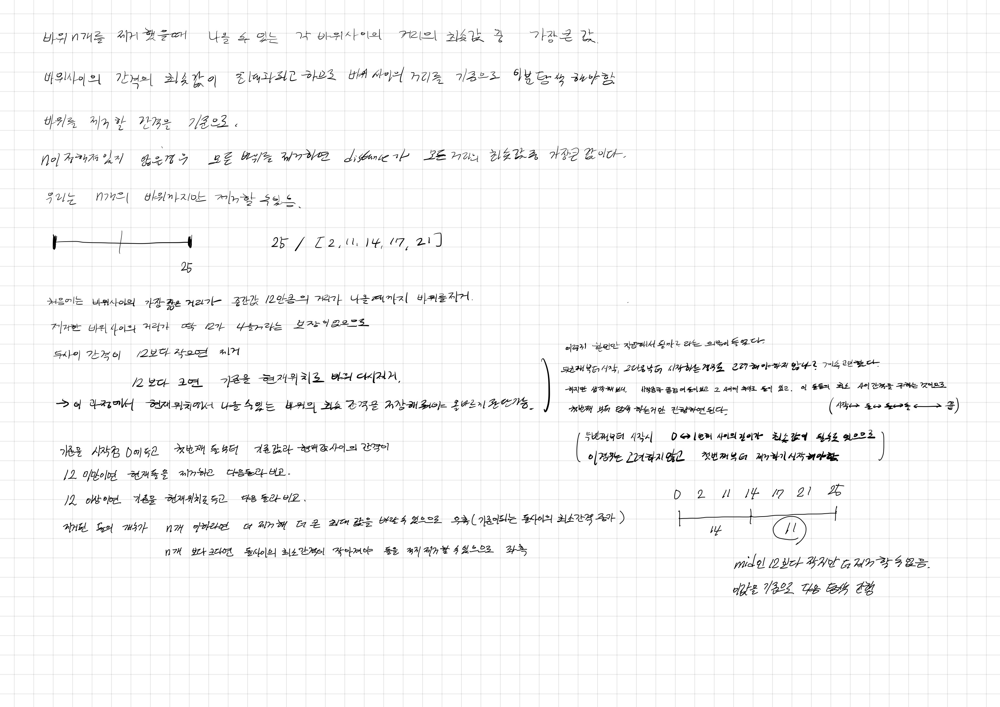

# 2022.10.14.

# 징검다리

[징검다리](https://school.programmers.co.kr/learn/courses/30/lessons/43236?language=java)

4단계라 무서웠지만, 프로그래머스에 고득점 킷에 이분 탐색에 2개 밖에 없어서 풀었다.

30분 고민하다가 뭘 기준으로 이분 탐색해야하는거지? 전혀 감이 잡히지 않아

검색해서 다른 사람들 설명을 봤다. 그래도 전혀 이해 되지 않았다가,

[이 글](https://school.programmers.co.kr/questions/31861) 을 보고 힘 얻어서, 이 글로 공부 했다.

결국 풀기는 했는데 솔직히 이해 다 안됐다. 다시 풀라고 하면 또 못 풀 것 같다.

한 3시간 넘게 하고 있는거라 더이상은 비효율적 인 것 같아 오늘은 여기까지 하려고 한다.
