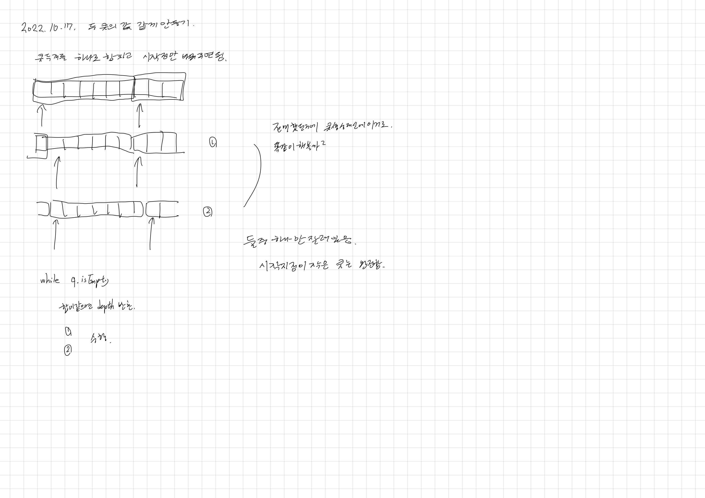

# 2022.10.17.

# 두 큐 합 같게 만들기

[두 큐 합 같게 만들기](https://school.programmers.co.kr/learn/courses/30/lessons/118667)



Set 에 넣어 전에 확인 했던 경우는 확인하지 않도록 해 테스트케이스 추가적으로 맞기는 했으나 시간 초과, 메모리 초과

지금 처럼 완전 탐색, Bfs 는 아닌가... 다른 조건을 추가해 줘야하나...

-> 질문 확인

```
큐를 이용하면 22,23,24 무조건 타임오버 생깁니다. 배열과 포인터를 이용해야해요. 
어차피 정해진 두개의 큐를 빼고넣을뿐이므로 실제로 큐 그자체를 돌릴필요가 없어요. 
하나의 큐 두개를 합친 하나의 배열만 만들어두고 
그다음 큐1과 큐2 각각의 시작시점을 잡는 포인터에 해당하는 변수 두개만 변환해주면 훨신 더 효율적으로 가동 가능.
```

시간 초과 났다.

음... 쉽게 해결 할 수 있는 문제를 어렵게 해결하고 있는 느낌이 든다.

오늘도 너무 오래 끌어서 내일 해야겠다.