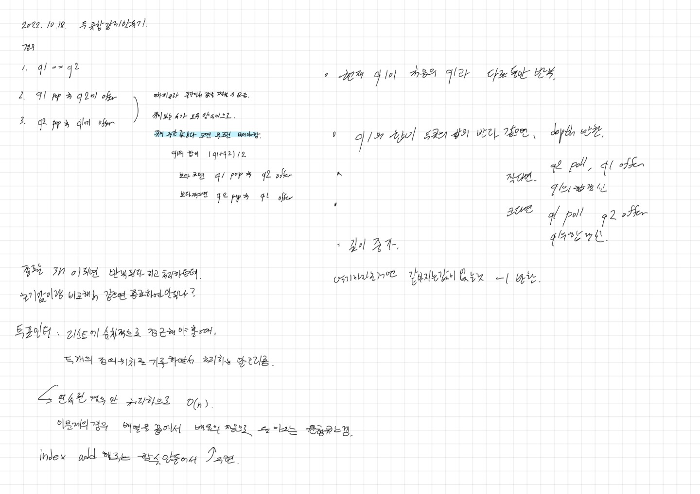

# 2022.10.18.

# 두 큐 합 같게 만들기

[두 큐 합 같게 만들기](https://school.programmers.co.kr/learn/courses/30/lessons/118667)

큐라 순서가 보장되고 데이터에 양수만, 그래서 투 포인터로 풀 수 있음.

내가 전에 한 경우는 음수나, 중간에서 추출 가능한 경우에 사용해야 할 것 같다.

투 포인터도 처음엔 객체 만들고, 범위에 따라 큐의 합 반환하는 메서드 만드려고 했었다가

더 쉬운 방법이 있을 것 같아. 학교 가는길에 블로그를 찾아봤다.

블로그에서는 3 * N 까지만 반복하면 된다고 했는데 나는 거기까지는 이해 못해서

Integer.MAX_VALUE 로 처리했다.

일부 테스트 케이스만 실패해서 찾아보니

큐의 합이 int 범위를 넘어서 생긴 문제로 long 으로 바꿔서, 진행했더니 통과 됐다.