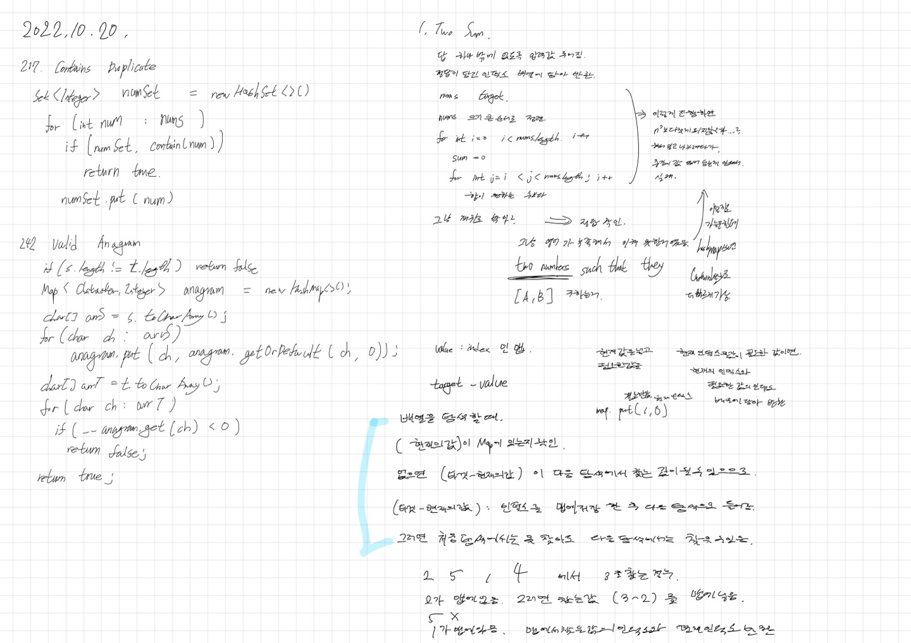

# 2022.10.20.

[neetcode](htts://neetcode.io)

커리어리라는 앱에서 코딩테스트 실력 올리는 법, 이라는 글을 봤다.

릿코드에서 풀면 좋은 150 문제를 모아두고, 해설 강의 까지 있다고 해서 혹해서 오늘 해봤다.

문제는 쉬웠는데 이해가 어려웠다.

번역을 돌려도 부분부분 돌려서 놓치는 부분이 있었다.

그리고 문제에서 제한한 조건을 잘 확인 해야 했다.

그냥 이거겠지 가 아니라 문제를 정확하게 파악 해야지만 풀 수 있었다.

간단한 개념이라 2문제는 유사코드로 풀고, 한문제는 직접 풀어봤다.

이렇게 풀수도 있구나~ 하는 것을 알게 되어 좋았지만,

쉬운 문제도 이런데 문제가 어려워지면 영어는 또 어떡하지? 라는 고민이 들어

내일은 계속 풀지 아니면 백준을 할지는 고민해봐야겠다.

## TwoSum

[TwoSum](https://leetcode.com/problems/two-sum/)

문제를 잘 못 이해해 완전 탐색으로 for for 하는것도 안되지 않나...? 생각하다가

이렇게 어려운 문제일리 없다 싶어서 해설을 봤다.

문제를 이해하고, HashMap 을 이용한 풀이도 이해했다.

감이 안오다가, 내가 컴퓨터다 생각하고 값을 대입해 가면서 진행하니까 좀 이해가 됐다.
