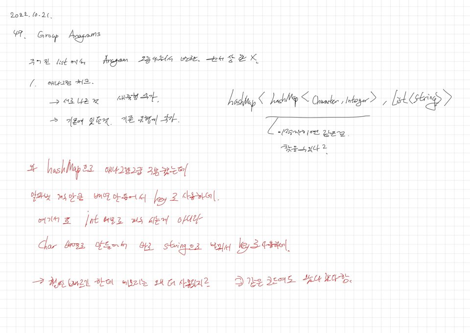
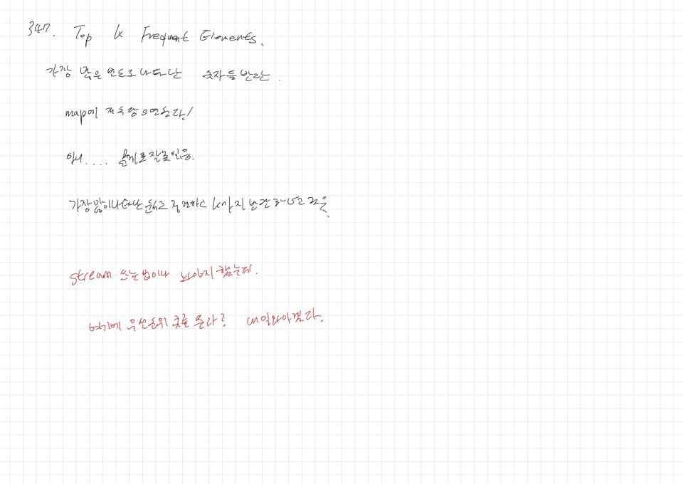

# 2022.10.21.

[neetcode](https://neetcode.io)

## 49. Group Anagrams

[Group Anagrams](https://leetcode.com/problems/group-anagrams/)

풀고 사이트에서 제시한 답도 확인 했다.

나는 문자들의 조합을 HashMap 에 담아서 확인 했는데,

그냥 총 알파벳 개수 만큼 배열 만들어서 해결했다.

## 347. Top K Frequent Elements

[Top K Frequent Elements](https://leetcode.com/problems/top-k-frequent-elements/)

이건 문제를 제대로 이해 못해서 두번 풀었다.

처음엔 가장 자주 나오는 것들 반환하는 줄 알고 java stream 익힐겸 천천히 풀었는데,

알고보니까 문제를 잘 못 읽었다.

자주 나오는 순서대로 k 개를 배열에 담아 반환하는 거였다.

java compareTo 이용해서 풀었다.

근데 사이트 코드 보니까 우선순위 큐를 이용해서 풀었다.

이거 보면 너무 시간 오버 될 것 같아서 내일 보려고 한다.
